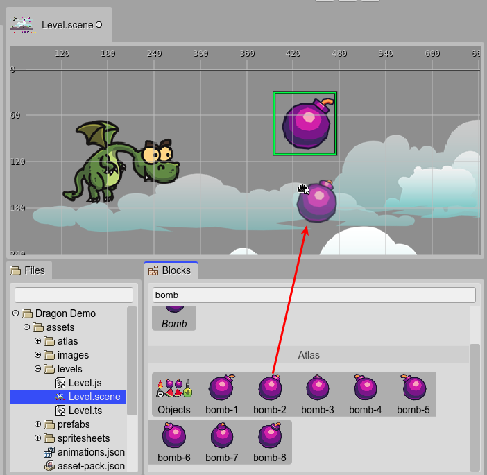

.. include:: ../_header.rst

Image objects
-------------

The `Image <image-object.html>`_ is a built-in Phaser_ object type: `Phaser.GameObjects.Image <https://photonstorm.github.io/phaser3-docs/Phaser.GameObjects.Image.html>`_.

You can create an `Image`_ object by dropping an Image built-in type or texture from the `Blocks view <blocks-view-integration.html>`_.

The main difference between an `Image`_ and a `Sprite <sprite-object.html>`_ is that the `Image`_ objects cannot play `sprite animations <https://photonstorm.github.io/phaser3-docs/Phaser.GameObjects.Sprite.html#play__anchor>`_.

An `Image`_ is created in code using the `image factory <https://photonstorm.github.io/phaser3-docs/Phaser.GameObjects.GameObjectFactory.html#image__anchor>`_. This is how the `scene compiler <scene-compiler.html>`_ generates the code of an `Image`_:

.. code::

  const branch_1 = this.add.image(192, 512, "atlas-props", "branch-01");

The `Image`_ has properties common to other object types:

* `Variable properties <variable-properties.html>`_

* `Lists properties <lists-properties.html>`_

* `Parent Container properties <parent-container-properties.html>`_

* `Transform properties <transform-properties.html>`_

* `Origin properties <origin-properties.html>`_

* `Flip properties <flip-properties.html>`_

* `Visible property <visible-property.html>`_

* `Alpha properties <alpha-properties.html>`_

* `Texture property <texture-property.html>`_
