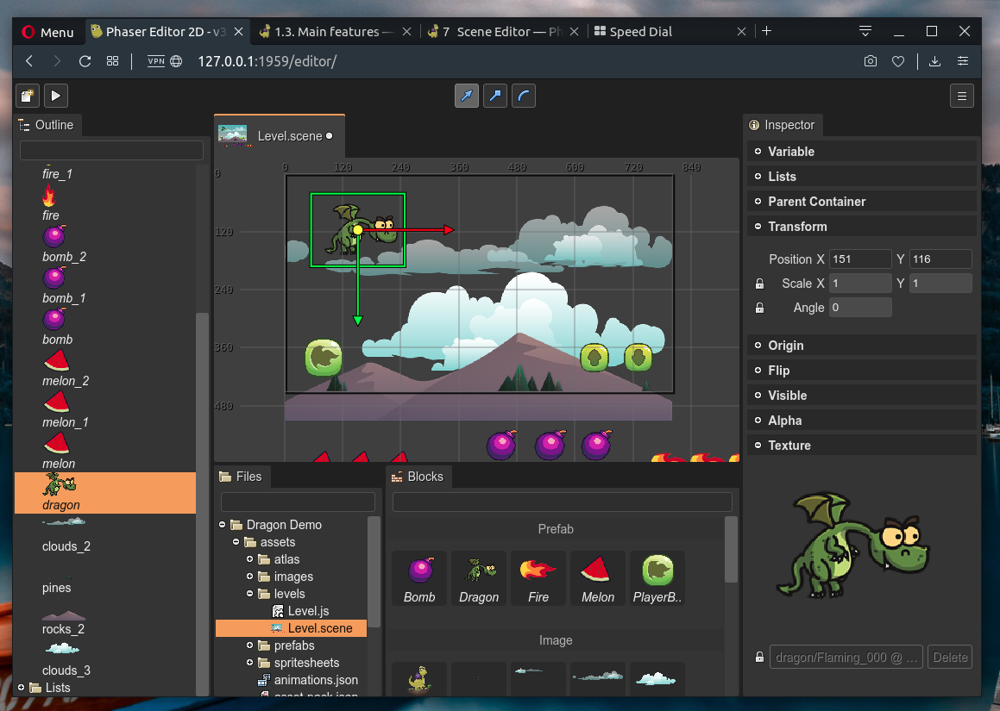

.. include:: ../_header.rst
   
.. highlight:: javascript

Scene Editor
------------

.. toctree::
    :maxdepth: 1

    create-new-scene-file
    add-object
    supported-types
    common-object-properties
    image-object    
    sprite-object
    tile-sprite-object
    text-object
    bitmap-text-object
    container-object
    object-list
    display-list
    prefabs
    replace-object-type
    manipulation-tools
    scene-compiler
    troubleshooting

The |SceneEditor|_ is the most important editor of the IDE, it provides the visual tools to create scenes (or levels).

The |SceneEditor|_ is similar to other scene makers tools. The most particular characteristic is that this editor `compiles the scene <scene-compiler.html>`_ into readable Phaser_ code.

Phaser_ provides support for certain file formats like the |AssetPackFile|_ (edited by the |AssetPackEditor|_), but it lacks a full-feature Scene file format suitable for level editors. Maybe it should be that way because Phaser_ is a framework and you may use it in very different ways and very different contexts.

How can we develop a scene editor? We know we need to save the scene in a custom format. We have two main options:

#. We can create a custom runtime, or plugin, to load the scene files in the game and create the objects in the fly.

#. We can create a scene compiler, that translates the scene data file into Phaser_ code.

The second option plays much better with the |PhaserEditor|_ philosophy of being fully compatible with a vanilla Phaser_ runtime. So this compiler gets a scene data file (``.scene``) and generates a clean, readable, hand-writing-like Phaser_ code. Even this option has other advantages: it is very easy to debug the scene and knowing exactly how the objects are created and modified.

In previous desktop-based versions of |PhaserEditor|_, the |SceneEditor|_ used a custom renderer to build the scene. This render was based on desktop UI toolkits. In this version, we use Phaser_ and the browser to render the scene in the editor. It is a huge advantage, now what you see in the |SceneEditor|_ is what you get in the game.

This chapter covers in depth the |SceneEditor|_ tools and concepts, if you want a quick tutorial to create a scene, read the `First steps chapter <../first-steps/index.html>`_.