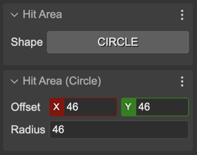
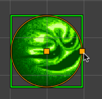

.. include:: ../_header.rst

Circle Hit Area
~~~~~~~~~~~~~~~

You can add a circular hit are to an object by seleting the ``CIRCLE`` shape in the **Hit Area** section. Then you can change the radius and position of the circle in the **Hit Area (Circle)** section:

Also, you can change the circle properties with the **Edit Hit Area Tool** (``I``):

The |SceneCompiler|_ generates code for setting the circle area in this way:

.. code::
    
    // wizball
    const wizball = this.add.image(191, 161, "wizball");
    wizball.setInteractive(
        new Phaser.Geom.Circle(46, 46, 46),
        Phaser.Geom.Circle.Contains);