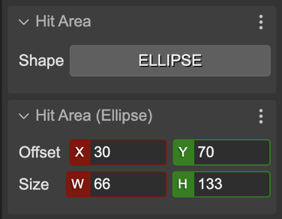
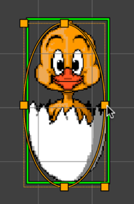

.. include:: ../_header.rst

Ellipse Hit Area
~~~~~~~~~~~~~~~~

You can set an ellipse as shape for the hit area of an object. Select the ``ELLIPSE`` option in the **Shape** parameter and changes the ellipse properties in the **Hit Area (Ellipse)** section:

Also, you can change the ellipse properties with the **Edit Hit Area Tool** (``I``):

The |SceneCompiler|_ generates the hit are shape code like this:

.. code::

    // chicken
    const chicken = this.add.image(684, 126, "budbrain_chick");
    chicken.setInteractive(
        new Phaser.Geom.Ellipse(30, 70, 66, 133),
        Phaser.Geom.Ellipse.Contains);