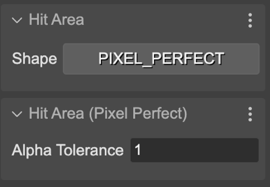

.. include:: ../_header.rst

Pixel Perfect Hit Area
~~~~~~~~~~~~~~~~~~~~~~

To enable the pixel-perfect hit area in an object, select the ``PIXEL_PERFECT`` option in the **Hit Area** section and set the ``alphaTolerance`` in the **Hit Area (Pixel Perfect)** section:

The **Alpha Tolerance** parameter is "the alpha level that the pixel should be above to be included as a successful interaction".

The |SceneCompiler|_ generates the code for setting pixel perfect hit area in this way:

.. code::
    
    const ship = this.add.image(1000, 281, "thrust_ship2");
    ship.setInteractive(this.input.makePixelPerfect());
    