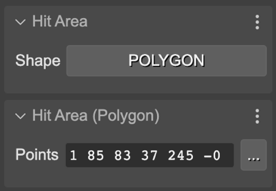
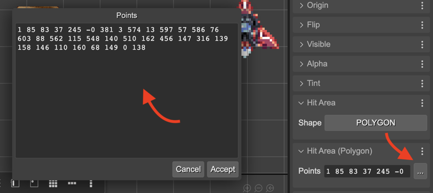
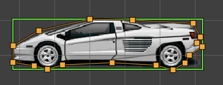
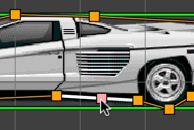
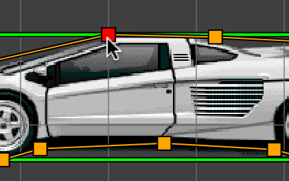

.. include:: ../_header.rst

Polygon Hit Area
~~~~~~~~~~~~~~~~

You can set a polygon hit area to an object by selecting the ``POLYGON`` option in the **Shape** parameter in the **Hit Area** section. The polygon is made with an array points. The points are represented in a string of numbers, with this syntax: ``"{P1.x} {P2.y} ... {Pn.x} {Pn.y}"``. You can change the points in the **Hit Area (Polygon)**:

You can click in the 3-dots button for getting a bigger text box and edit all the points:

Or you can use the **Edit Hit Area Tool** (``I``) for adding, deleting, and changing the points of the polygon:

You can add a point by placing the mouse in a line and dragging the pink point:

You can delete a polygon point by placing the mouse pointer on top of it and pressing the ``Delete`` key. The point to delete is highlighted in red:

To modify a point, drag it 🙂.

The |SceneCompiler|_ generates the code for setting the polygon hit area like this:

.. code::

  // car
  const car = this.add.image(616, 523, "supercars-parsec");
  car.setInteractive(
    new Phaser.Geom.Polygon(
      "1 85 83 37 245 -0 381 3 574 13 597 57 586 76 603 88 562 115 548 140 510 162 456 147 316 139 158 146 110 160 68 149 0 138"
      ), Phaser.Geom.Polygon.Contains);

