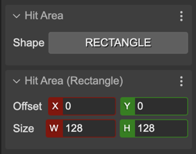
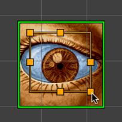

.. include:: ../_header.rst

Rectangle Hit Area
~~~~~~~~~~~~~~~~~~

To set a rectangular hit are on the object, select the ``RECTANGLE`` option in the **Shape** parameter of the **Hit Area** section. It enables the **Hit Area (Rectangle)** section where you can set the position and size of the area:

Also, you can change the values with the **Edit Hit Area** tool (``I``):

When you create a rectangle hit area, the scene compiler generates a code like this:

.. code::

    // eye
    const eye = this.add.image(369, 277, "lance-overdose-loader-eye");
    eye.setInteractive(
        new Phaser.Geom.Rectangle(17, 16, 90, 80),
        Phaser.Geom.Rectangle.Contains);