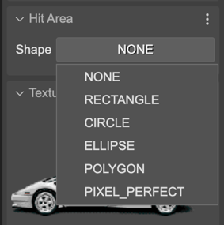

.. include:: ../_header.rst

Hit Area
--------

.. toctree::
    :maxdepth: 1

    input-hit-area-rectangle
    input-hit-area-ellipse
    input-hit-area-circle
    input-hit-area-polygon
    input-hit-area-pixel-perfect

Making interactive objects is part of almost every game. You can enable an interactive hit area for an object right in the |InspectorView|_. You can select in the **Hit Area** section the shape for the interactive area of an object. By default, the shape is ``NONE``, which means the object doesn't have a hit are at all.

The available hit area shapes are:

* Rectangle
* Ellipse
* Circle
* Polygon
* Pixel Perfect

Each shape has a dedicated section for the shape's properties. In addition of the section, you can activate the **Edit Hit Area** tool (``I``) and change the properties of the area by dragging handlers in the scene.

