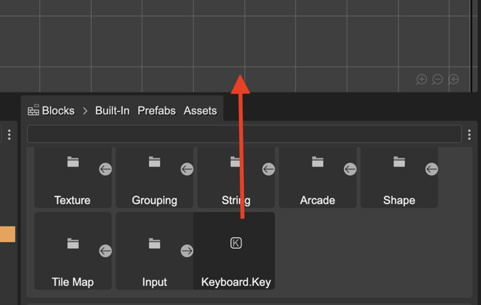
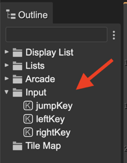
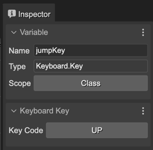
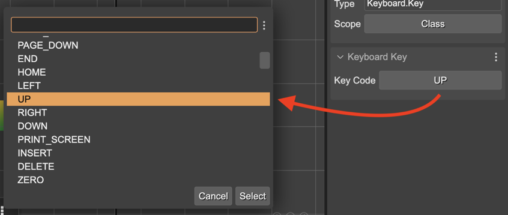

.. include:: ../_header.rst

Keyboard Key object
~~~~~~~~~~~~~~~~~~~

The |SceneEditor|_ supports adding a `Phaser.Input.Keyboard.Key <https://newdocs.phaser.io/docs/3.55.2/Phaser.Input.Keyboard.Key>`_ object to the scene. Just drag the **Keyboard.Key** object from the |BlocksView|_ and drop it into the scene:

The editor shows the **Key** objects in the **Input** section of the |OutlineView|_:

Select a key for editing its properties in the |InspectorView|_:

The **Variable** properties:

* **Name**: The name of the variable for the Key object.
* **Scope**: The scope of the variable. It may be ``LOCAL``, ``METHOD``, ``CLASS``, or ``PUBLIC``. By default it is ``PUBLIC``. You can `learn more about the variable scopes <./variable-properties.html#scope-property>`_.

The **Keyboard Key** properties:

* **Key Code**: the `keyCode <https://newdocs.phaser.io/docs/3.55.2/Phaser.Input.Keyboard.Key#keyCode>`_. Click on the button for selecting the code:

The code generated for the key code is like this:

.. code::

        // in the context of a scene:

        const jumpKey = this.input.keyboard
                .addKey(Phaser.Input.Keyboard.KeyCodes.UP);

        // in the context of a prefab:

         const jumpKey = this.scene.input.keyboard
                .addKey(Phaser.Input.Keyboard.KeyCodes.UP);

A common usage of the keys, is to assign it to a field (set the ``Class`` scope) and check for its **down** state in the **update** method:

.. code::

    update() {

        if (this.jumpKey,isDown) {

            this.player.body.velocity.y = -400;
        }
    }