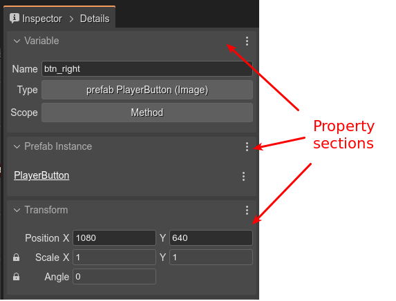
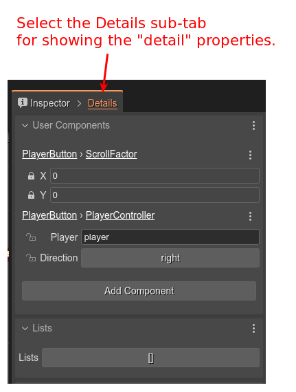
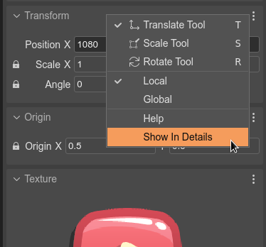

.. include:: ../_header.rst

Inspector view
~~~~~~~~~~~~~~

The **Inspector**, is a `general view <../workbench/inspector-view.html>`_ for showing the properties of the objects selected in other parts of the IDE.

When the |SceneEditor|_ is active, the Inspector view shows the properties of the objects selected in the scene.

It groups the properties in sections:

Some properties are considered as "detail" properties, and are not shown by default. To show these properties, you have to select the **Details** sub-tab in the **Inspector** tab:

If you wish, you can move a property section to the **Details** sub-tab, or remove it from there. Open the section's menu and check or uncheck the **Show in Details** option:

