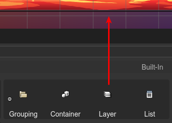

.. include:: ../_header.rst

Layer objects
-----------------

The `Phaser.GameObjects.Layer <https://photonstorm.github.io/phaser3-docs/Phaser.GameObjects.Layer.html>`_ object type allows grouping objects. Unlike the `Container <./container-object.html>`_ objects, a layer cannot be transformed. It doesn't have position, angle or scale. Its only purpose is to sort the objects for rendering, quickly.

`Learn more about Layers in the Phaser docs <https://photonstorm.github.io/phaser3-docs/Phaser.GameObjects.Layer.html>`_.

`Learn more about working with parent objects in the Scene Editor <./working-with-parent-objects.html>`_.

You can create a Layer by dropping a `Layer built-in block <blocks-view-integration.html>`_ on the scene,  or with the `Create Layer with Selection <#grouping-objects-in-a-layer>`_ command.

The code generated by the |SceneCompiler|_, to create a Layer, is like this:

.. code::
    
    // create the layer
    const layer_1 = this.add.layer();

    // create an object and add it to the layer 
    const someObject = ... ;
    layer_1.add(someObject);

Grouping objects in a Layer
~~~~~~~~~~~~~~~~~~~~~~~~~~~

You can create a layer with a couple of objects. You can do this by selecting the objects and executing the  `Create Layer with Selection <#grouping-objects-in-a-layer>`_ command. The command is available in the `Parent context menu <./working-with-parent-objects.html#the-parent-context-menu>`_.

When you execute the command, the selected objects are removed from the original parents and added to the new layer. All objects keep the same absolute position. If all objects are children of a common layer, then the new layer will be added to the original parent layer.

Layer properties
~~~~~~~~~~~~~~~~~~~~

The Layer type contains some of the `common object properties <common-object-properties.html>`_:

* `Variable properties <variable-properties.html>`_

* `Lists properties <lists-properties.html>`_

* `Children properties <children-properties.html>`_

* `Visible property <visible-property.html>`_

* `Alpha property <alpha-properties.html>`_
