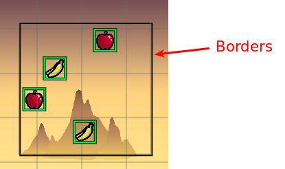
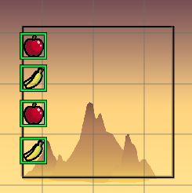
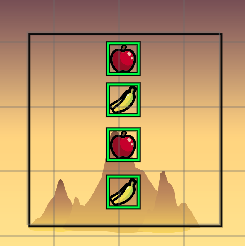
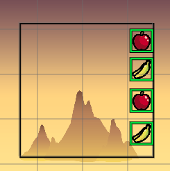
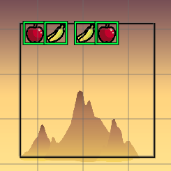
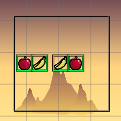
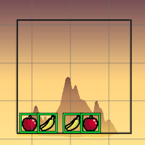

.. include:: ../_header.rst

Align To Border layout tools
~~~~~~~~~~~~~~~~~~~~~~~~~~~~

Like the `Align tools <layout-tools-align.html>`_, the Align To Border tools place the objects in a line, but this line is one of the borders or the scene.

The borders of the scene are set in the `Scene's properties <border-properties.html>`_.

Starting with this configuration:

The border alignment lines are:

**Left**

**Center**

**Right**

**Top**

**Middle**

**Bottom**

