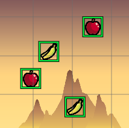
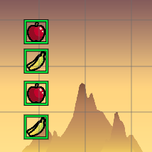
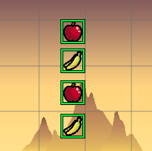
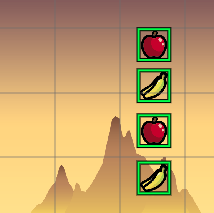
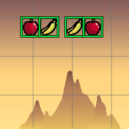
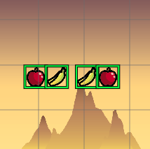
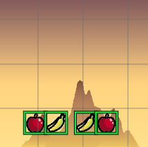

.. include:: ../_header.rst

Align layout tools
~~~~~~~~~~~~~~~~~~

The Align tools provides shortcuts for laying out objects in the same line. The alignment line could be one of the following: **Left**, **Center**, **Right**, **Top**, **Middle**, and **Bottom**.

Let's see the lines starting with this configuration:

**Align Left**

Align to the vertical line with a minimus X:

**Align Center**

Align to the vertical line with the average X:

**Align Right**

Align to the vertical line with a maximum X:

**Align Top**

Align to the horizontal line with a minimus Y:

**Align Middle**

Align to the horizontal line with the average Y:

**Align Bottom**

Align to the horizontal line with a maximum Y:

