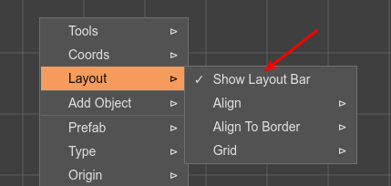

.. include:: ../_header.rst

Layout tools
------------

.. toctree::
    :maxdepth: 1

    layout-tools-align
    layout-tools-align-to-border
    layout-tools-origin
    layout-tools-grid

Laying out the objects in a scene is one of the most attractive features the |SceneEditor|_ provides. The `Layout tools <layout-tools.html>`_ are shortcuts for aligning and distributing the objects of a scene. You can find the tools in the Layout context menu or the Layout toolbar.

It works this way:

1. Select the objects you want to layout:

2. Execute a layout operation, selecting a layout tool in the Layout context menu or the Layout toolbar. You can undo or redo this operation:

    .. image:: ../images/scene-editor-layout-tools-steps-2-20220812.webp
        :alt: Apply layout.

3. If the tool requires parameters, set them in the parameters pane of the Layout toolbar:
    
    .. image:: ../images/scene-editor-layout-tools-steps-2.1-20220812.webp
        :alt: Apply layout

You can show/hide the Layout toolbar by checking the **Show Layout Bar** option in the Layout menu:

