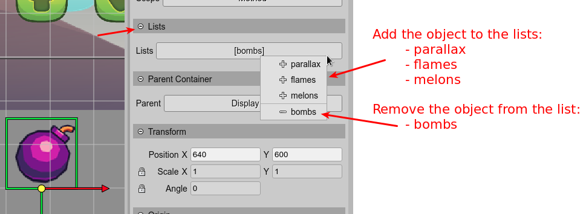

.. include:: ../_header.rst

Lists properties
~~~~~~~~~~~~~~~~

The `Lists <lists-properties.html>`_ property is not part of the Phaser_ API. It is a property used by the |SceneEditor|_ to add objects to a list. It is the "parent lists" of the object.

As you can learn in the `Object List <object-list.html>`_ section, the editor allows to group objects in lists.

The button next to the property shows the lists that the object belongs to. You can click on the button to: 

* Add the object to another list.
* Remove the object from a list.

