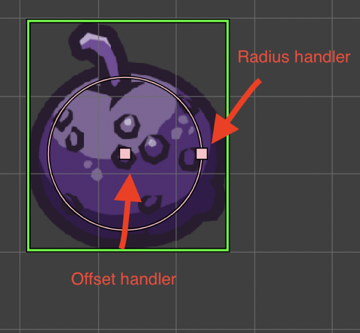
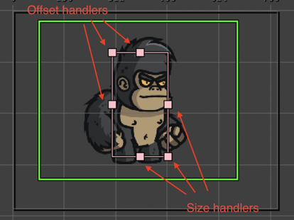

.. include:: ../_header.rst

Arcade Physics Body tool
~~~~~~~~~~~~~~~~~~~~~~~~

This tool allows changing the size and offset of an Arcade physics body. You can activate the tool in the scene context menu of by pressing the ``B`` key.

There are two type of bodies: circular and rectangular bodies. When you are editing a circular body, the tool shows the body's circle, the center (offset), and the radius handlers:

If the object has a rectangular body, then the tool shows the offset and size handlers:

