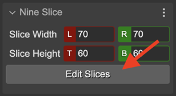

.. include:: ../_header.rst

Slice tool
~~~~~~~~~~

This is a tool for changing the size of the slices of a `NineSlice <nine-slice-object.html>`_ object. You can activate it in the context menu, with the **Tools → Slice Tool** option. Or you can activate it in the Nine Slice properties section, by clicking the **Edit Slices** button:

The tools shows four maniputaros for changing the size of the slices:

.. image:: ../images/scene-editor-slice-tool-manipulators-20230208.webp
  :alt: Slice manipulators.

If you want to change the width of the **left** and **rigth** slices at the same time and with the same value, you can press and hold the ``Shift`` key. It also applies to the height of the **top** and **bottom** slices.

If the object is in a 3 slices mode, it only shows the manipulators for the width slices:

