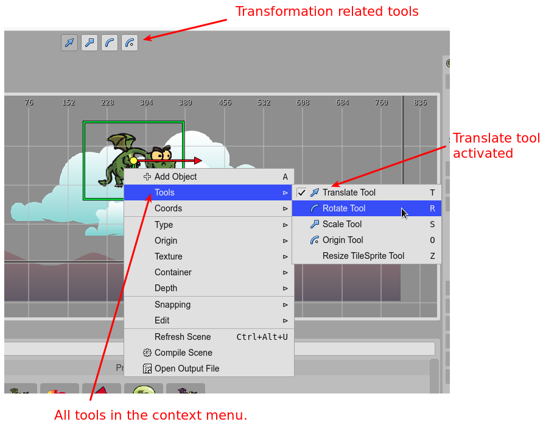
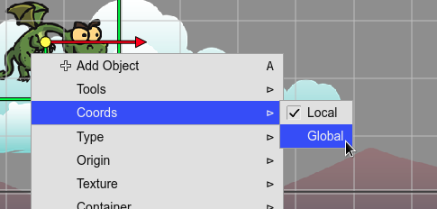
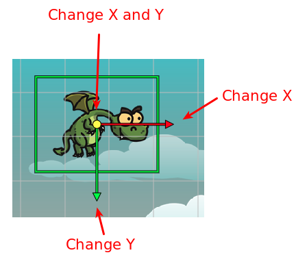
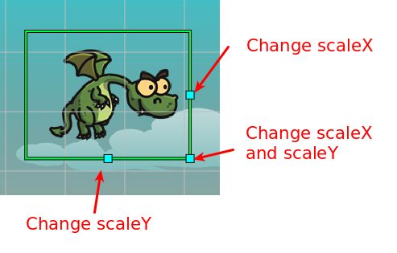
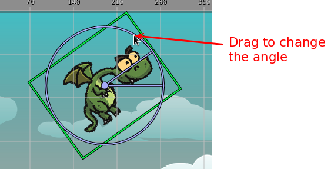
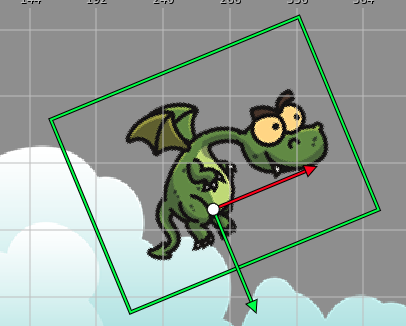
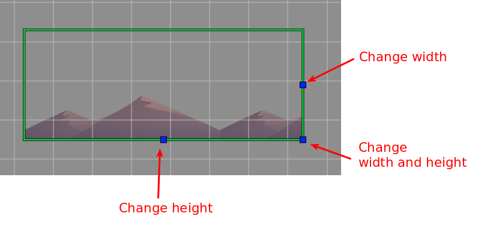
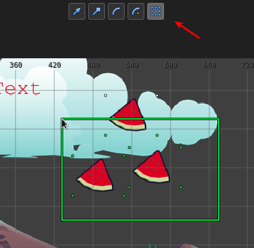

.. include:: ../_header.rst

Manipulation tools
------------------

The manipulator tools are in-scene tools that allow changing properties of the objects.

Each tool has a command to activate/deactivate it. You can execute the command using a key, the context menu, or the |MainToolbar|_.

You can activate one tool or the time. Or deactivate the tool.

Coordinates
~~~~~~~~~~~

Some tools can be used in a local or global coordinates. You can change the coords in the **Coords** menu of the context menu:

Translate tool
~~~~~~~~~~~~~~

This tool allows you to move the objects on the screen. It affects the **X** and **Y** properties.

You can activate it with the ``T`` key, or in the context menu or the |MainToolbar|_.

Drag the red arrow to change the **X**, and the green arrow to change the **Y**.

Scale tool
~~~~~~~~~~

Activate this tool to change the scale of an object. You can activate it in the context menu, the |MainToolbar|_, or with the ``S`` key.

Rotate tool
~~~~~~~~~~~

This tool changes the angle of the object. You can activate it in the context menu, the |MainToolbar|_, or with the ``R`` key.

Origin tool
~~~~~~~~~~~

With this tool, you can edit the origin of an object. You can activate it in the context menu, the |MainToolbar|_, or with the ``O`` key.

In Phaser_ v3, the rotation pivot of `containers <container-object.html>`_ is fixed at ``x=0, y=0``. You cannot change it. However, the `origin tool`_ simulates a change of the pivot by moving around the children of the `container <container-object.html>`_ but keeping the same global position.

Resize Tile Sprite tool
~~~~~~~~~~~~~~~~~~~~~~~

This tool allows for changing the size of a `TileSprite <tile-sprite-object.html>`_ object.  You can activate it in the context menu or with the ``Z`` key.

This tool only applies to `TileSprite`_ objects, but you can `convert any object to a TileSprite <replace-object-type.html>`_.

Select Region tool
~~~~~~~~~~~~~~~~~~

This tool allows you to draw a region in the scene and select all objects inside that zone. You can select it in the toolbar, the context menu or by pressing the ``Shift+S`` keys. If you keep pressing the `Ctrl` key, the previous selected objects will remain selected.

