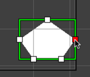
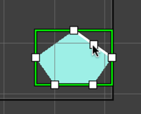
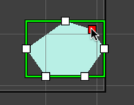
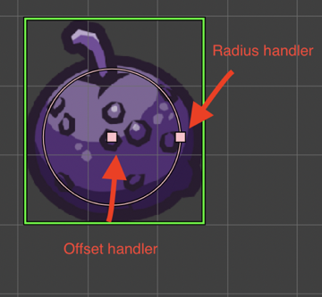
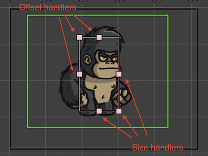

.. include:: ../_header.rst

Manipulation tools
------------------

.. contents::

The manipulator tools are in-scene tools that allow changing properties of the objects.

Each tool has a command to activate/deactivate it. You can execute the command using a key, the context menu, or the |MainToolbar|_.

You can activate one tool or the time. Or deactivate the tool.

.. image:: ../images/scene-editor-tools-05242020.webp
    :alt: Manipulators.

Coordinates
~~~~~~~~~~~

Some tools can be used in a local or global coordinates. You can change the coords in the **Coords** menu of the context menu:

.. image:: ../images/scene-editor-tools-coords-05242020.webp
    :alt: Transformation orientation.

Translate tool
~~~~~~~~~~~~~~

This tool allows you to move the objects on the screen. It affects the **X** and **Y** properties.

You can activate it with the ``T`` key, or in the context menu or the |MainToolbar|_.

Drag the red arrow to change the **X**, and the green arrow to change the **Y**.

.. image:: ../images/scene-editor-tools-translate-04262020.webp
    :alt: Translate tool.

Scale tool
~~~~~~~~~~

Activate this tool to change the scale of an object. You can activate it in the context menu, the |MainToolbar|_, or with the ``S`` key. Keep pressing the ``Shift`` key if you want to scale proportionally.

.. image:: ../images/scene-editor-tools-scale-04262020.webp
    :alt: Scale tool.

Rotate tool
~~~~~~~~~~~

This tool changes the angle of the object. You can activate it in the context menu, the |MainToolbar|_, or with the ``R`` key.

.. image:: ../images/scene-editor-tools-rotate-04262020.webp
    :alt: Rotate tool.

Origin tool
~~~~~~~~~~~

With this tool, you can edit the origin of an object. You can activate it in the context menu, the |MainToolbar|_, or with the ``O`` key.

In Phaser_ v3, the rotation pivot of `containers <container-object.html>`_ is fixed at ``x=0, y=0``. You cannot change it. However, the `origin tool`_ simulates a change of the pivot by moving around the children of the `container <container-object.html>`_ but keeping the same global position.

.. image:: ../images/scene-editor-tools-origin-05242020.webp
    :alt: Origin tool.

Resize tool
~~~~~~~~~~~

This tool allows for changing the size of some objects like `TileSprite <tile-sprite-object.html>`_, `Rectangle <shape-object.html#rectangle>`_, and `Ellipse <shape-object.html#ellipse>`_.  You can activate it in the context menu or with the ``Z`` key. Resize the object is not the same of scaling it.

.. image:: ../images/scene-editor-tools-tilesprite-size-04262020.webp
    :alt: TileSprite size tool.

Polygon tool
~~~~~~~~~~~~

The Polygon tool (that you can activate with the ``Y`` key) shows the polygon's points in the scene. It allows you:

* Change the position of a point: drag the point with the mouse cursor.
* Delete a point: move the mouse cursor over the point and press the `Delete` key (or double click). When the cursor is over the point, it is painted in red color.

* Add a new point: move the mouse cursor over a line. It shows a white handler under the cursor, you can drag it for creating a new point.

Arcade Physics Body tool
~~~~~~~~~~~~~~~~~~~~~~~~

This tool allows changing the size and offset of an Arcade physics body. You can activate the tool in the scene context menu of by pressing the ``B`` key.

There are two type of bodies: circular and rectangular bodies. When you are editing a circular body, the tool shows the body's circle, the center (offset), and the radius handlers:

If the object has a rectangular body, then the tool shows the offset and size handlers:

Select Region tool
~~~~~~~~~~~~~~~~~~

This tool allows you to draw a region in the scene and select all objects inside that zone. You can select it in the toolbar, the context menu or by pressing the ``Shift+S`` keys. If you keep pressing the `Ctrl` key, the previous selected objects will remain selected.

.. image:: ../images/scene-editor-tools-select-region-06172020.webp
    :alt: Select objects in region tool.

Pan tool
~~~~~~~~

This tool allows you to pan the scene. You can activate it with the ``Space`` key. When it is selected, the mouse cursor is shown with a "grabbing" icon, then you can click on the scene and drag it.

Also, you can pan the scene by pressing the ``Alt`` key and dragging the mouse. This method does not require to activate the Pan tool.