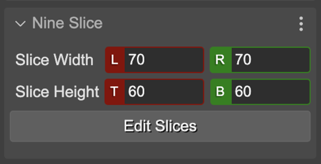
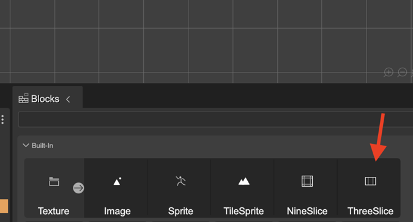
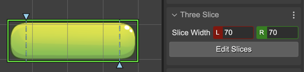

.. include:: ../_header.rst

Nine Slice objects
------------------

The `Nine Slice <nine-slice-object.html>`_ is a built-in Phaser_ object type: `Phaser.GameObjects.NineSlice <https://photonstorm.github.io/phaser3-docs/Phaser.GameObjects.NineSlice.html>`_. This type allows you to display a texture-based object that can be stretched both horizontally and vertically, but that retains fixed-sized corners.

A `Nine Slice`_ is created in code using the `nineSlice factory <https://photonstorm.github.io/phaser3-docs/Phaser.GameObjects.GameObjectFactory.html#nineSlice__anchor>`_. This is how the |SceneCompiler|_ generates the code of a `Nine Slice`_:

.. code::

  const nineslice = this.add.nineslice( 
                                0, 600, // x, y
                                "ui", "green-button", // texture, frame
                                300, 200, // width, height
                                70, 70, // leftWidth, rightWith
                                60, 60); // topHeight, bottomHeight

To create a `Nine Slice`_ object in the scene, you should follow these steps:

1. Drop a `NineSlice built-in block <blocks-view-integration.html>`_ on the scene: 
  .. image:: ../images/scene-editor-create-9slice-1-20230208.webp
    :alt: Drop a nine slice object to the scene
2. Select a texture for the object by pressing `X` or opening the Texture Dialog in the Texture section:
  .. image:: ../images/scene-editor-nineslice-create-2-20230208.webp
    :alt: Select texture
  .. image:: ../images/scene-editor-nineslice-create-3-20230208.webp
    :alt: The result of selecting the texture
3. Change the size of the object. In the `Size section <size-properties.html>`_, you can set the width and height of the object. Also you can use the `Resize tool <./manipulation-tools.html#resize-tool>`_ (press the ``Z`` key):
  .. image:: ../images/scene-editor-nineslice-create-4-20230208.webp
    :alt: Resize the object
4. In the `Nine Slice properties`_ section, change the size of the slices. Also you can activate the `Nine Slice tool <manipulation-tools.html#slice-tool>`_, and change the sizes in the scene:
  .. image:: ../images/scene-editor-nineslice-create-5-20230208.webp
    :alt: Edit the slice size.

By the way, you can `convert an Image or Sprite or any other game object into a Nine Slice <replace-object-type.html>`_.

Nine Slice properties
~~~~~~~~~~~~~~~~~~~~~

The `Nine Slice`_ type shares properties with other object types:

* `Variable properties <variable-properties.html>`_

* `Lists properties <lists-properties.html>`_

* `Transform properties <transform-properties.html>`_

* `Origin properties <origin-properties.html>`_
  
* `Size properties <size-properties.html>`_

* `Visible property <visible-property.html>`_

* `Alpha single property <alpha-single-property.html>`_

* `Tint properties <tint-properties.html>`_

* `Texture property <texture-property.html>`_

But also it has particular properties:

* The `leftWidth <https://photonstorm.github.io/phaser3-docs/Phaser.GameObjects.NineSlice.html#leftWidth__anchor>`_ and `rightWidth <https://photonstorm.github.io/phaser3-docs/Phaser.GameObjects.NineSlice.html#rightWidth__anchor>`_ properties. It changes the size of the horizontal slices.

* The `topHeight <https://photonstorm.github.io/phaser3-docs/Phaser.GameObjects.NineSlice.html#topHeight__anchor>`_ and `bottomHeight <https://photonstorm.github.io/phaser3-docs/Phaser.GameObjects.NineSlice.html#bottomHeight__anchor>`_ properties. It changes the size of the vertical slices.

Three Slice mode
~~~~~~~~~~~~~~~~

The NineSlice object can be created with only three horizontal slices. This is an optimization for objects you only need to stretch horizontally. This optimization is activated if you set the **top** and **bottom height** to ``0``.

In Phaser Editor 2D, we provide a **ThreeSlice** blocks for creating this particular configuration of the Nine Slice object. You can drop this block into the scene for creating the object:

When the Nine Slice object is in the 3-slices mode, you can change the size of the slices with the `Slice Tool <manipulation-tools.html#slice-tool>`_ and the **Three Slice properties** section. Note it only shows the width properties and manipulators:

