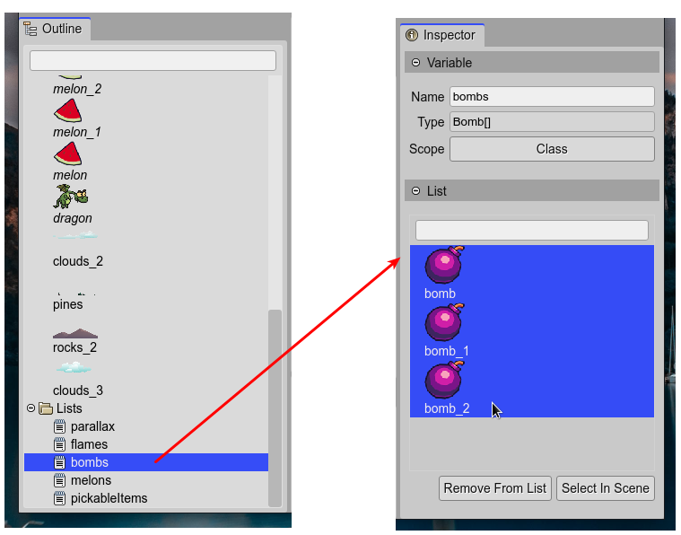
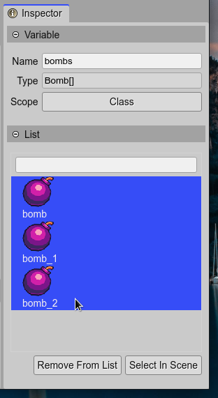

.. include:: ../_header.rst

Object List
-----------

Often, you need to group objects with a common property or type, or with a common goal in the game. For example, you need to group the enemy objects, the pickable items, the platform objects, so you can test if the player collides with them.

For this purpose, the |SceneEditor|_ allows grouping the objects of the scene into a JavaScript array.

You can create an `Object List`_ using the `Add Object dialog <add-object-dialog.html>`_.

To add an object to an `Object List`_, you can set the `Lists property <lists-properties.html>`_ of the object, in the |InspectorView|_.

The code generated by the |SceneCompiler|_, to create a list, is like this:

.. code::

    this.pickableItems = [melon, melon_1, melon_2, bomb, bomb_1, bomb_2];

If the output language is TypeScript, the |SceneCompiler|_ generates a field declaration for the list:

.. code::
        
    private pickableItems: Array<Melon|Bomb>;

Note that the |SceneCompiler|_ infers the type of the array elements: a union of ``Melon`` and ``Bomb``, that are prefabs_. It also infers the type of the elements if are Phaser_ built-in types:

.. code::

    private parallax: Phaser.GameObjects.Image[];

This detailed type declaration of the arrays allows that code editors like |VSCode|_ can provide a smarter coding experience.

Object List properties
~~~~~~~~~~~~~~~~~~~~~~

The `Object List`_ type is not part of the |PhaserAPI|_, it is something introduced by the |SceneEditor|_. It has the `Variable properties <variable-properties.html>`_ and it also shows the **List** section in the |InspectorView|_.

Look the **Remove From List** and **Select In Scene** buttons apply to the items selected in the viewer next to them.

Object List vs Phaser Group
~~~~~~~~~~~~~~~~~~~~~~~~~~~

Traditionally, Phaser_ uses the `Group game object <https://photonstorm.github.io/phaser3-docs/Phaser.GameObjects.Group.html>`_ to join objects around a common purpose. But grouping is not the only feature of a `Group game object`_:

* It implements an object pool.

* Is a data structure with methods for sorting and iterate the items.

* Can be used as a proxy to modify the state of the items.

* To call a method of the items.

* To apply game-related global operations to the items.

So, why the |SceneEditor|_ is not using the `Group game object`_?

#. Many of the features of a `Group game object`_ are especially helpful to implement the logic of the game, but what a level maker needs is just to organize the objects, we think. 

#. The `Group game object`_ type is not parameterized. A code editor type-inference/auto-completion engine works much better with a simple JavaScript array. When you write ``const enemies = [enemy1, enemy2, ...]``, a code editor like |VSCode|_ can infer the type of the array items.

#. Even for a human, a simple JavaScript array could be more comprehensible. 

#. If you need a `Group game object`_, you can create it with the array of objects generated by the |SceneEditor|_:

    .. code::

        const pickableItemsGroup = this.add.group(this.pickableItems);
