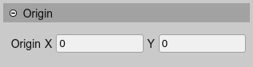
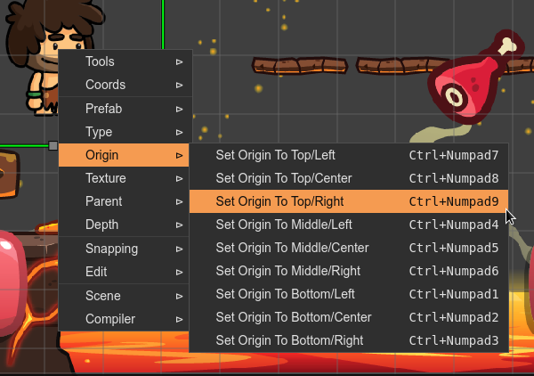

.. include:: ../_header.rst

Origin properties
-----------------

The `origin properties <https://photonstorm.github.io/phaser3-docs/Phaser.GameObjects.Components.Origin.html#setOrigin__anchor>`_ of the object can be modified in the |InspectorView|_:

There are commands to change the origin to a preset value. These commands are available in the scene context menu or by pressing a key shortcut:

Also, you can change the origin of an object with the `origin manipulator tool <manipulation-tools.html#origin-tool>`_ or the `origin layout tool <./layout-tools-origin.html>`_.
