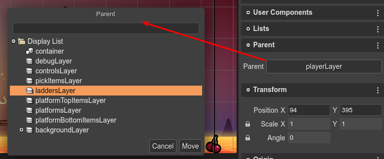

.. include:: ../_header.rst

Parent properties
-----------------

The Parent property shows the parent's (a `Container <./container-object.html>`_, a `Layer <./layer-object.html>`_, or the `Display List <display-list.html>`_) of the selected object.

You can click on the button to move the object to new parent.

When you change the parent of an object, the local position of the object is modified to keep the same absolute position.

Also, you can open this dialog with the `Move To Parent <working-with-parent-objects.html#moving-an-object-to-a-parent>`_ command.