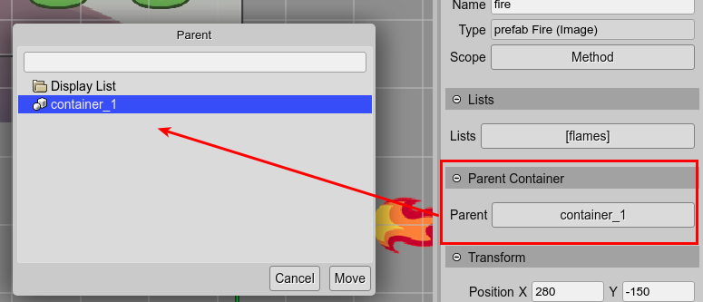

.. include:: ../_header.rst

Parent Container properties
---------------------------

The Parent Container property shows the `Container <container-object.html>`_ that contains the selected object.

You can click on the button to move the object to other `Container`_ or the `Display List <display-list.html>`_.

When you change the parent of an object, the local position of the object is modified to keep the same absolute position.

