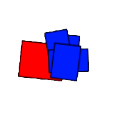
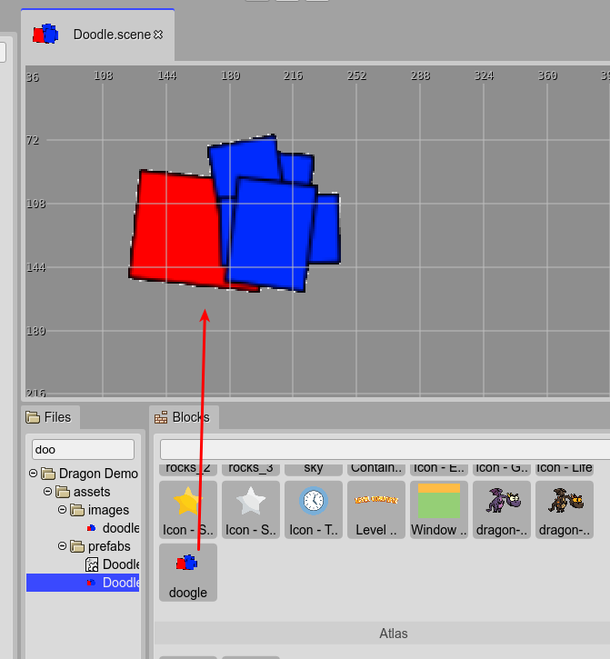
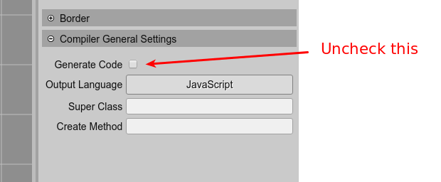
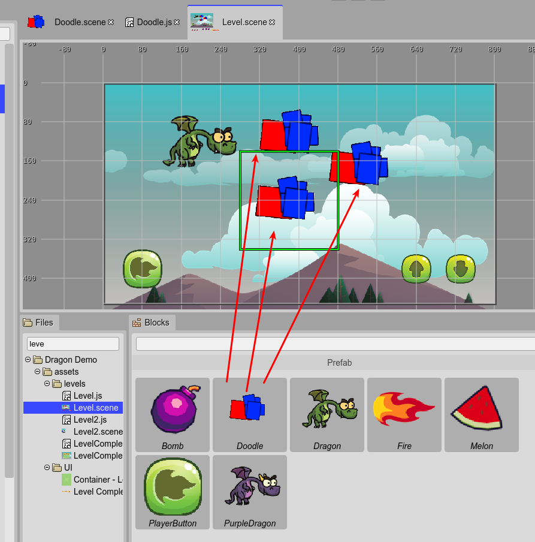
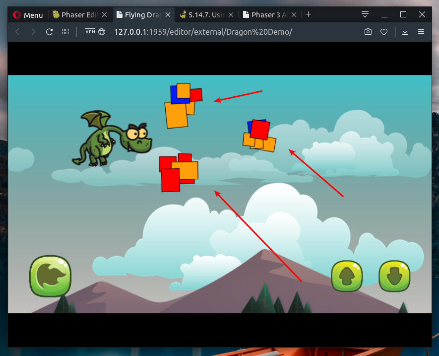

.. include:: ../_header.rst

Using a prefab as a black box
~~~~~~~~~~~~~~~~~~~~~~~~~~~~~

At this moment, the |SceneEditor|_ supports a small subset of the object types present in the |PhaserAPI|_. Eventually, we will implement support for all the built-in object types.

However, if you need to add to the scene an object of an unsupported type (a Phaser_ object type or any other no fully supported by Phaser_) you can "cheat" the |SceneEditor|_ using a prefab_ as a black box.

A prefab_ as a black box is a very simple concept: it is a prefab_ that is not compiled by the |SceneCompiler|_, so you should write the code of the prefab_ class manually.

For example, let's say you want to add to the scene some objects with a texture that is generated on the fly, with shapes of random colors and positions. Let's name them "doodles".

First, create a texture similar to what you want, at least, with the same dimensions (100x100 in this example).

Something like this:

It is a reference texture. Upload it to the project and add it to the |AssetPackFile|_. You can create a new |AssetPackFile|_ that will be used only by the editor, so you can exclude it from the distribution build of the game.

So, create a **Doodle** prefab_ with the **doodle** texture:

We have our prefab_. But you want to generate the texture on the fly. To do this, first disable the compilation of the scene, in the `Scene compiler settings <scene-compiler-general-settings.html>`_:

Now that you disabled the code compilation, you have to write the ``Doodle`` class in the ``Doodle.js`` file. It is a simple class, it extends the `Phaser.GameObjects.Image <https://photonstorm.github.io/phaser3-docs/Phaser.GameObjects.Image.html>`_ but instead of a real image texture it will generate its texture, on the fly:

.. code::

    class Doodle extends Phaser.GameObjects.Image {

        static ID = 0;
        static COLORS = ["red", "blue", "orange"];

        /**
         * @param scene {Phaser.Scene}
         */
        constructor(scene, x, y) {
            super(scene, x, y);

            // create a new texture key
            Doodle.ID++;
            const key = "doodle-" + Doodle.ID;

            // create a new canvas-based texture and add it
            // to the TextureManager with the new key
            const texture = scene.textures.createCanvas(key, 200, 200);

            // get the context of the texture and draw the random doodle
            const ctx = texture.getContext();

            ctx.strokeStyle = "black";

            // draw 5 shapes
            for (let i = 0; i < 5; i++) {
                
                ctx.save();

                // add a little rotation to the shape        
                const angle = Phaser.Math.RND.integerInRange(-10, 10);                
                ctx.rotate(Phaser.Math.DegToRad(angle));
                
                ctx.beginPath();
                
                // draw a rect, at a random position with a random size
                ctx.rect(
                    Phaser.Math.RND.integerInRange(0, 50),
                    Phaser.Math.RND.integerInRange(0, 50),
                    Phaser.Math.RND.integerInRange(20, 50),
                    Phaser.Math.RND.integerInRange(20, 50));
                
                // fill it with a random color
                const color = Phaser.Math.RND.pick(Doodle.COLORS);
                ctx.fillStyle = color;

                ctx.fill();
                ctx.stroke();
                
                ctx.restore();
            }

            // needed if the game is using the WebGL renderer
            texture.refresh();

            // set the new texture to the object
            this.setTexture(key);
        }

    }

The **Doodle** prefab_ is ready. Open the **Level** scene file and add a couple of **Doodle** |PrefabInstances|_ to it:

Note all **Doodle** instances look the same. The custom code you wrote is executed in the game, not in the editor. The editor is using the ``doodle.png`` image you created as a reference.

Look in the ``Level.js`` file: the |PrefabInstances|_ are created as expected.  The trick here is that the code inside the **Doodle** constructor is your code, not the code generated by the |SceneCompiler|_. You only need to write a constructor signature that is compatible with the code of the ``Level.js`` file:

.. code::

    class Level extends Phaser.Scene {
        
        constructor() {
            super("Level");
            
        }
        
        create() {

            // ...

            // doodle
            const doodle = new Doodle(this, 388, 105);
            this.add.existing(doodle);
            
            // doodle_1
            const doodle_1 = new Doodle(this, 380, 240);
            this.add.existing(doodle_1);
            
            // doodle_2
            const doodle_2 = new Doodle(this, 530, 170);
            this.add.existing(doodle_2);

            // ...
        }
        
    }

So, run the game now: you will see the **Doodle** instances are rendered with random shapes and colors. The instances are using your custom code and your way to create the textures:

This "black box" trick is not perfect. An ideal editor should run your **Doodle** custom code and show the |PrefabInstances|_ in the |SceneEditor|_ with the custom textures. But it is something very complex to implement. 

With a black box prefab_, you can do "black magic". Think that using it you can place 3D objects in the scene, by using a third-party framework and the `Extern game object <https://photonstorm.github.io/phaser3-docs/Phaser.GameObjects.Extern.html>`_. Or complex 2D objects modeled by animation tools. Or tile-maps created with a Phaser_ unsupported format.
