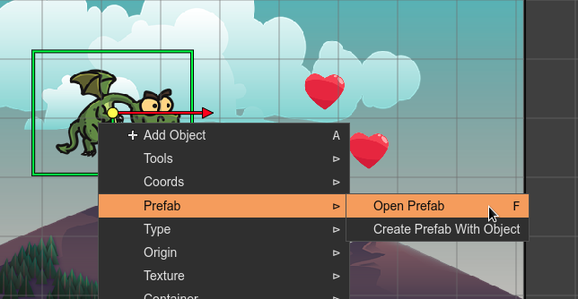
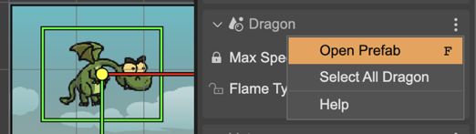

.. include:: ../_header.rst

Creating a prefab instance
~~~~~~~~~~~~~~~~~~~~~~~~~~

You can create a |PrefabInstance|_ by dropping a prefab_ file into the scene, dragging it from the |FilesView|_ or the |BlocksView|_.

When the active editor is a |SceneEditor|_, the |BlocksView|_ shows the |AssetPackFile|_ items and the prefab_ files:

.. image:: ../images/scene-editor-prefab-create-instance-04202020.webp
    :alt: Create prefab instance.

You can open the prefab_ file of a |PrefabInstance|_ with the **Open Prefab** command. You can press the ``F`` key or execute the command in the context menu, in the **Prefab** sub-menu:

The |InspectorView|_ shows a section for each prefab (and prefab variant) of the selected objects. In the menu of the section, you can click the **Open Prefab** option:

