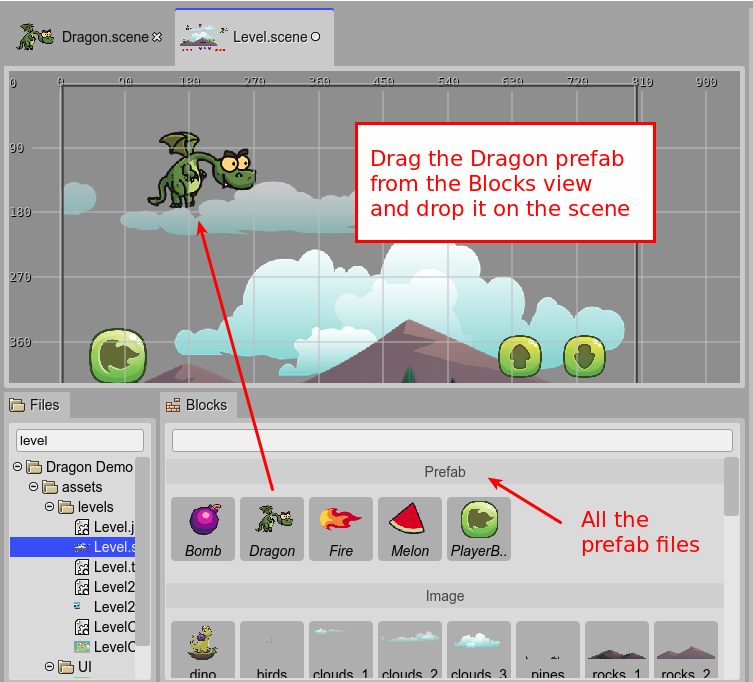
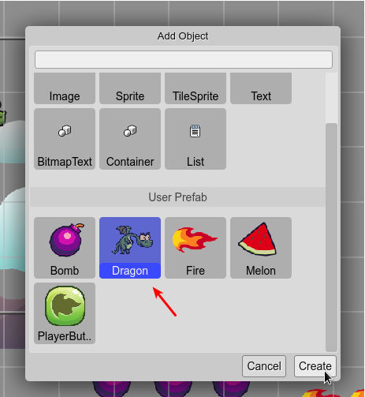
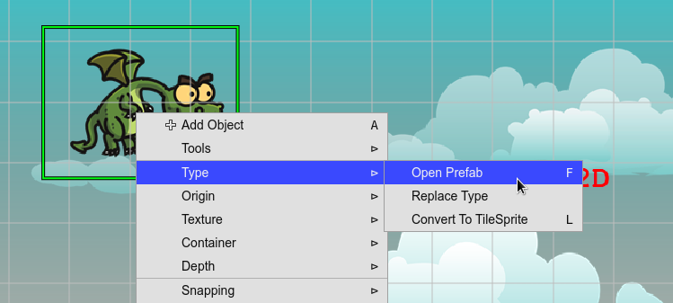

.. include:: ../_header.rst

Creating a prefab instance
~~~~~~~~~~~~~~~~~~~~~~~~~~

You can create a |PrefabInstance|_ by dropping a prefab_ file into the scene, dragging it from the |FilesView|_ or the |BlocksView|_.

When the active editor is a |SceneEditor|_, the |BlocksView|_ shows the |AssetPackFile|_ items and the prefab_ files:

Also, you can create a |PrefabInstance|_ by selecting it in the `Add Object dialog <add-object-dialog.html>`_:

You can open the prefab_ file of a |PrefabInstance|_ with the **Open Prefab** command. You can press the ``F`` key or execute the command in the context menu, in the **Type** sub-menu:

