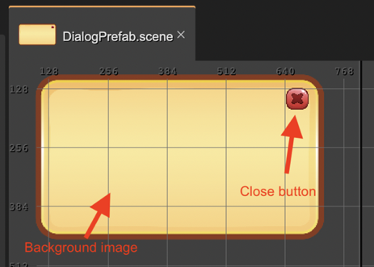
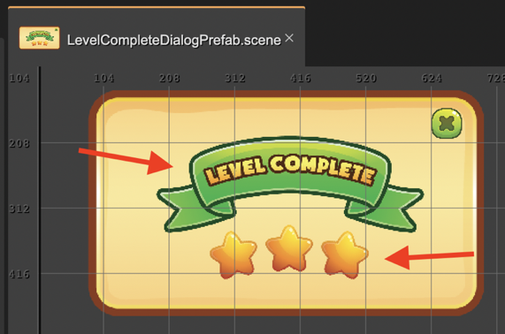
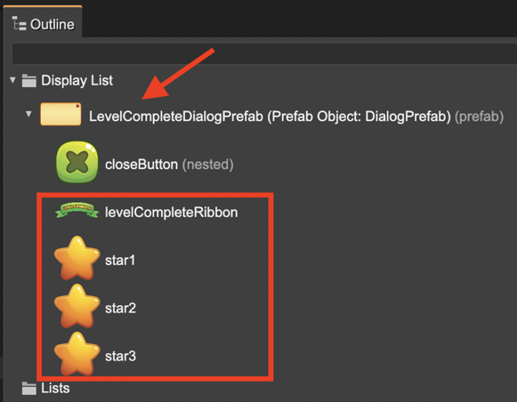
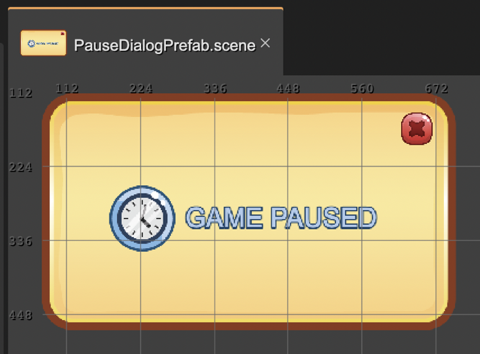

.. include:: ../_header.rst

Adding children to a prefab instance
~~~~~~~~~~~~~~~~~~~~~~~~~~~~~~~~~~~~

Since v3.35.0 of Phaser Editor 2D you can add children to a prefab instance. Sure, it should be an instance of a Layer or Container prefab.

For backward compatibility, this behavior is disabled by default in prefabs. You should enable it in the `Children properties section <children-properties.html>`_, setting on the **Allow Append Children** parameter. It means you have to checkmark that parameter in a Container or Layer prefab or nested prefab.

This is a handy feature for creating reusable objects. Let's see the next example.

We want to create a reusable dialog object that we can use for showing *Level Complete* dialog or a *Game Paused* dialog.

We create a **DialogPrefab** with a basic structure: a **background** image and a close button. In addition to the structure, it also has a basic behavior: it animates from the bottom of the screen and if you click the **close** button it closes the dialog:

Some considerations:

* For allowing adding new children to the prefab instances, we should check the **Allow Append Children** parameter we mentioned before.
* Maybe we want to change the texture of the **close** button in prefab instances, so we make it a nested prefab.

Now let's create the **LevelCompleteDialogPrefab**. It is a new prefab that is a variant of the **DialogPrefab**. It means, the ``LevelCompleteDialogPrefab`` class extends the ``DialogPrefab`` class. In this new dialog, we add the **Level Complete** message and three reward stars and change the texture of the **close** button (to green).

Notice the new **levelCompleteRibbon**, and the **star1**, **star2**, and **star3** objects, are children of an instance of the **DialogPrefab** prefab. In previous versions of the editor, for getting a similar structure, you had to wrap a **DialogPrefab** with a new container and add the new objects to it. But now, you can add new children to the same prefab instance and at the same time, it inherits the behaviors of the **DialogPrefab**. It doesn't require any manual delegation of behaviors.

As result, we get the following code of the ``LevelCompletePrefab`` class:

.. code::

 class LevelCompleteDialogPrefab extends DialogPrefab {

 constructor(scene: Phaser.Scene, x?: number, y?: number) {
 super(scene, x ?? 400, y ?? 303);

 this.closeButton.setTexture("Button Pack - Green_Button Green - Close");

 // levelCompleteRibbon
 const levelCompleteRibbon = scene.add.image(0, -30, "Casual Game GUI_Attribute - Ribbon Green");
 levelCompleteRibbon.scaleX = 0.5;
 levelCompleteRibbon.scaleY = 0.5;
 this.add(levelCompleteRibbon);

 // star1
 const star1 = scene.add.image(-89, 81, "Casual Game GUI_Icon - Star Yellow");
 star1.scaleX = 0.5;
 star1.scaleY = 0.5;
 star1.angle = -10;
 this.add(star1);

 // star2
 const star2 = scene.add.image(-2, 71, "Casual Game GUI_Icon - Star Yellow");
 star2.scaleX = 0.5;
 star2.scaleY = 0.5;
 this.add(star2);

 // star3
 const star3 = scene.add.image(85, 81, "Casual Game GUI_Icon - Star Yellow");
 star3.scaleX = 0.5;
 star3.scaleY = 0.5;
 star3.angle = 10;
 this.add(star3);
 }
 }

Following the same pattern then we can create a **PauseDialogPrefab**:

