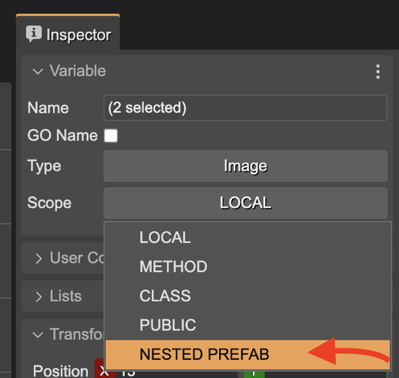
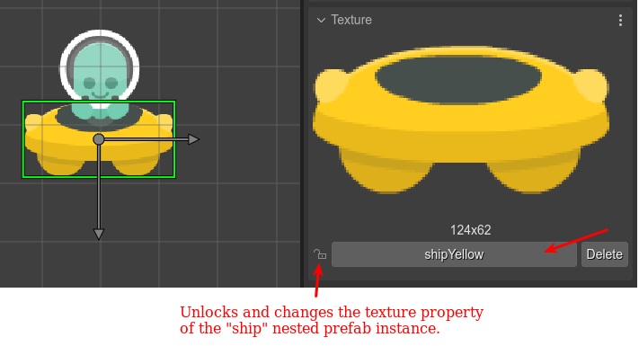

.. include:: ../_header.rst

Nested prefabs
~~~~~~~~~~~~~~

The nested prefab is a powerful concept. Like the overall prefab concept, it is inspired by |Unity|_. Its name describes its purpose: allow nesting prefabs.

There are many cases where your prefab is a compound of objects, and you would like to modify them in prefab instances. For example, look at this **AlienShip** prefab:

.. image:: ../images/scene-editor-nested-prefab-alienship-08182021.webp
    :alt: AlienShip, a prefab with nested prefabs.

It is a `container <container-object.html>`_, with an **alien** and a **ship** children.

When you create an instance of the **AlienPrefab** (that is an instance of a `container`_), you can change its position, its scale. It's custom properties. But you cannot change the properties of the **ship** or the **alien** children.

But if you declare the **alien** and **ship** objects as nested prefab, you can access them in the prefab instance.

For setting an object as nested prefab, you select the **NESTED_PREFAB** option in the **Scope** parameter of the **Variable** section:



Variables with a **NESTED_PREFAB** scopes are generated in code as public fields. It is like the **PUBLIC** scope but allowing to modify the object in prefab instances.

Nested prefab instances
```````````````````````

When you create an instance of a prefab that contains nested prefabs, the `Outline <../workbench/outline-view.html>`_ view shows the nested prefabs. Also, the |SceneEditor|_ allows selecting the nested prefab instance:


Note the nested prefab instance **ship** of the **AlienShip**'s prefab instance, has a different texture. Nested prefab instances work just like prefab instances: for changing a property, it first requires unlocking the property:



The code generated for the **alien1** object is like this:

.. code::

    // alien1
    const alien1 = new AlienShip(this, 142, 398);
    this.add.existing(alien1);
    alien1.ship.setTexture("shipYellow");

Note the nested prefab instance **ship** is a field of the prefab instance **alien1**.

Things you cannot do with nested prefab instances
`````````````````````````````````````````````````

In practice, nested prefabs are like prefabs, with certain differences:

(Remember a prefab is a type, a template, and a prefab instance is the realization of the prefab in the scene)

* In code, a prefab is a user JavaScript class. A nested prefab is part of a prefab. It is an object referenced by a prefab class field. 

* You cannot define user properties for a nested prefab (check the comment below).

* You cannot delete a nested prefab instance.

* You cannot change the type of a nested prefab instance.

A nested prefab is an object that is part of a prefab. Its type can be a built-in Phaser_ type or a prefab. You cannot define user properties for the nested prefab if it has a Phaser_ built-in type. But, if it has a prefab as a type, you can define user properties for that prefab. Saying it in other words. If you need to add custom properties to a nested prefab (**A**), then you can create a separated prefab scene (**B**) with user properties, and use that prefab **B** as type creating the nested prefab **A**.