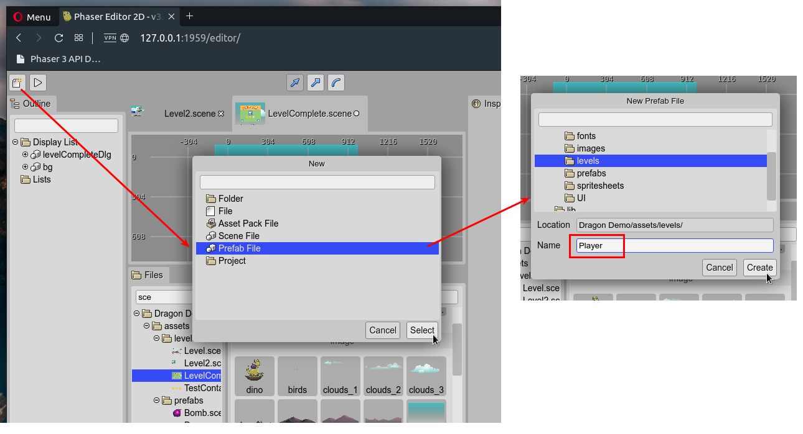

.. include:: ../_header.rst

Creating a prefab file
~~~~~~~~~~~~~~~~~~~~~~

A prefab_ is a scene file that you can create with the `New File dialog <../workbench/new-file-dialog.html>`_. In the dialog, select the **Prefab File** option. It opens the **New Prefab** dialog, where you can choose the parent folder and the name for the new prefab_ file. That name will be used to generate the class name of the prefab_, so let's write a valid class name.

Look the prefab_ file is just a scene file. When it is created, it is empty, you should create an object that will be `the prefab object <prefab-object.html>`_.

Also, you can create a prefab_ directly in the |SceneEditor|_. This operation is very handy. You can select and object and convert it to a new prefab:

#. Select an object in the scene.

#. Open the context menu and select the **Prefab** |-| **Create Prefab With Object** option.

    .. image:: ../images/scene-editor-new-prefab-file-with-object-06082020.webp
        :alt: Create prefab with object.

#. It opens the **New Prefab File** dialog. Select the file name and the location.

    .. image:: ../images/scene-editor-new-prefab-file-with-object-dialog-06082020.webp
        :alt: New prefab with object dialog.

#. The selected object is converted to an instance of the new prefab_. The new prefab_ is listed in the |BlocksView|_ and is ready to create new instances.