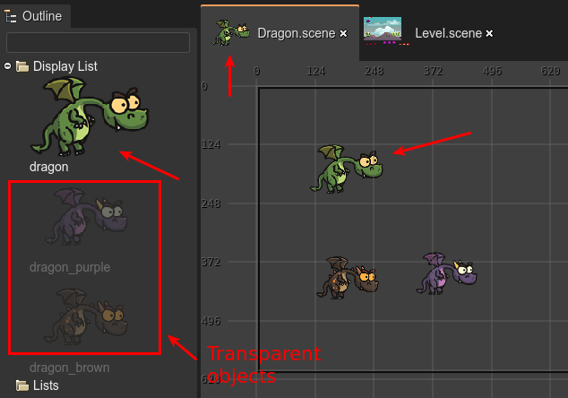
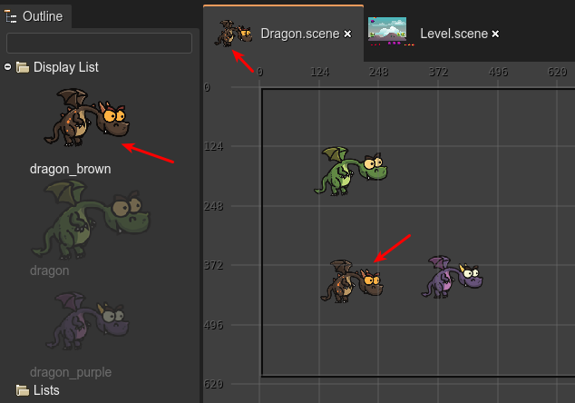

.. include:: ../_header.rst

The prefab object
~~~~~~~~~~~~~~~~~

The `prefab object <prefab-object.html>`_ is the object at the top of the prefab_ file. You can add many objects to the scene, but only the one at the top will be considered as the real prefab_, the other objects will be ignored.

We did it this way for simplicity, but it also allows us to create different versions of the `prefab object`_ and move them to the top of the list in case we want to promote a different object as the `prefab object`_.

Look in the next image, it shows the **Dragon** prefab. There are three objects in the file, but only the **green dragon** object will be used as the `prefab object`_ of the **Dragon** prefab_. Also, look the others, non-top objects are rendered transparent in the |OutlineView|_:



If later you decided to use a different dragon for your prefab_, then you can move it to the top of the scene and that's all:



Another characteristic of the `prefab object`_ is that you cannot edit its `Variable properties <variable-properties.html>`_, because, in the generated code, it is not referenced as a variable, it is referenced as ``this``.

The `prefab object`_ could be any object of any type (an `image <image-object.html>`_, a `text <text-object.html>`_, a `container <container-object.html>`_, whatever type supported by the |SceneEditor|_), even, it could be a |PrefabInstance|_. When the `prefab object`_ is a |PrefabInstance|_ (of the prefab_ **SomePrefab**) then we say it is a |PrefabVariant|_ of the **SomePrefab** prefab_.

Automatic Container creation
````````````````````````````

In many cases, your prefab_ will be a single object, like an image. In other cases, you do group several objects in a `Container <container-object.html>`_.

To simplify the workflow of creating a prefab_, the |SceneEditor|_ will follow these rules:

1. If you add an object in an empty prefab_ scene, the new object will be the `prefab object`_.

2. If you create an object, but the prefab_ scene already contains a `prefab object`_, then:

    2.1. If the `prefab object`_ is a `Container`_ , the new object is added to it.

    2.2. If the `prefab object`_ is not a `Container`_, then a new `Container`_ will be created to group the old `prefab object`_ and the new object. Finally, the newly created `container`_ will be the new `prefab object`_.

In a few words, following these rules, the |SceneEditor|_ automatically group the objects in a `Container`_, if needed.