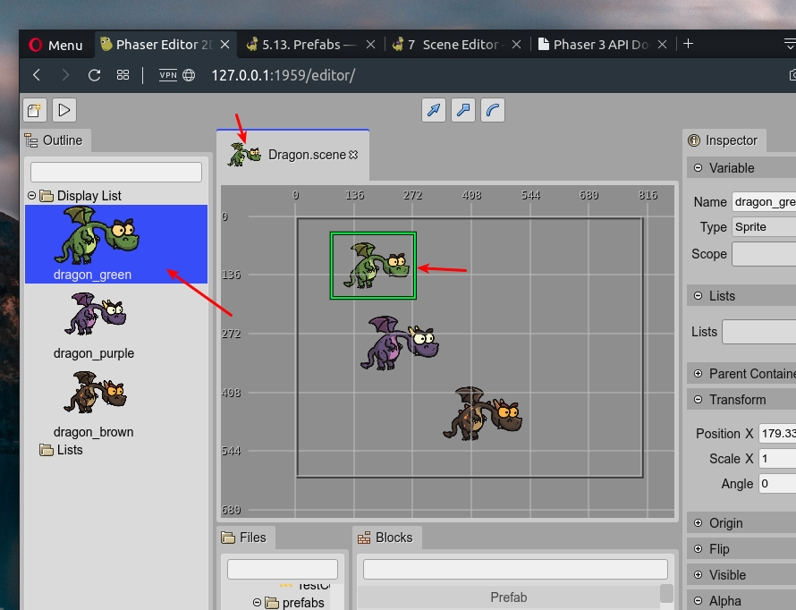
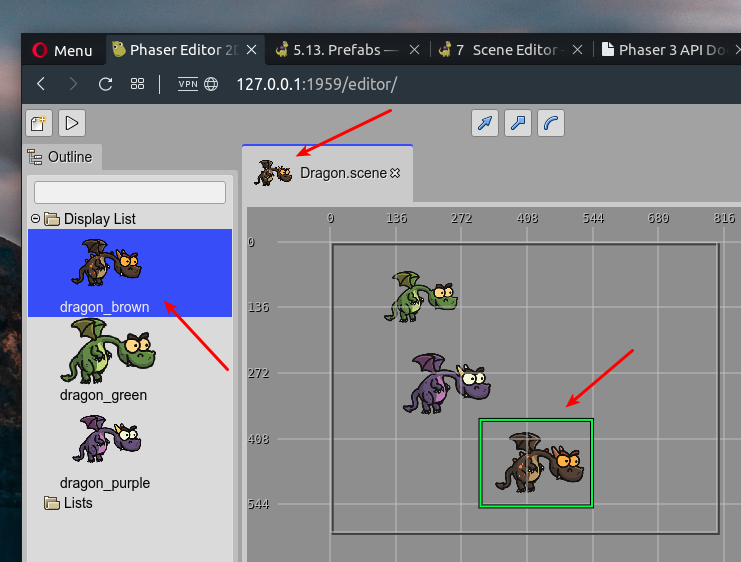

.. include:: ../_header.rst

The prefab object
~~~~~~~~~~~~~~~~~

The `prefab object <prefab-object.html>`_ is the object at the top of the prefab_ file. You can add many objects to the `display list <display-list.html>`_ of the prefab_, but only the one at the top will be considered as the real prefab_, the other objects will be ignored.

We did it this way for simplicity, but it also allows us to create different versions of the `prefab object`_ and move them to the top of the list in case we want to promote a different object as the `prefab object`_.

Look in the next image, it shows the **Dragon** prefab. There are three objects in the file, but only the **green dragon** object will be used as the `prefab object`_ of the **Dragon** prefab_:

If later you decided to use a different dragon for your prefab_, then you can move it to the top of the `display list`_ and that's all:

The `prefab object`_ could be any object of any type (an `image <image-object.html>`_, a `text <text-object.html>`_, a `container <container-object.html>`_, whatever type supported by the |SceneEditor|_), even, it could be a |PrefabInstance|_. When the `prefab object`_ is a |PrefabInstance|_ (of the prefab_ **SomePrefab**) then we say it is a |PrefabVariant|_ of the **SomePrefab** prefab_.