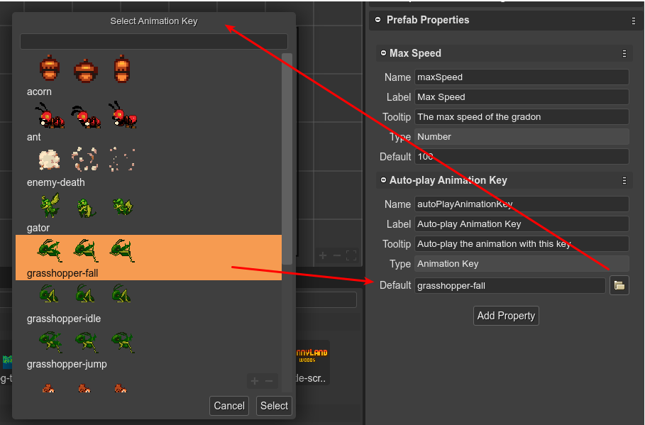

.. include:: ../_header.rst

Animation Key property type
```````````````````````````

This type is just like the `Asset Key property type <prefab-user-properties-asset-key-type.html>`_ but the dialog only shows the animations defined in the project:


