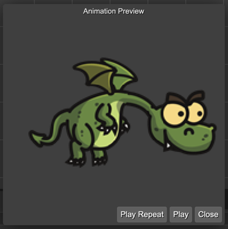

.. include:: ../_header.rst

Animation Key property type
```````````````````````````

This type is just like the `Asset Key property type <prefab-user-properties-asset-key-type.html>`_ but the dialog only shows the animations defined in the project.

Next to the animation key field, there is a button for selecting the animation key and a button for previewing the selected animation:


This is the dialog for selecting the animation key:

.. image:: ../images/prefab-user-props-animation-key-dialog-20231027.webp
  :alt: A dialog for selecting the animation key.

This is the dialog for previewing the selected animation:



