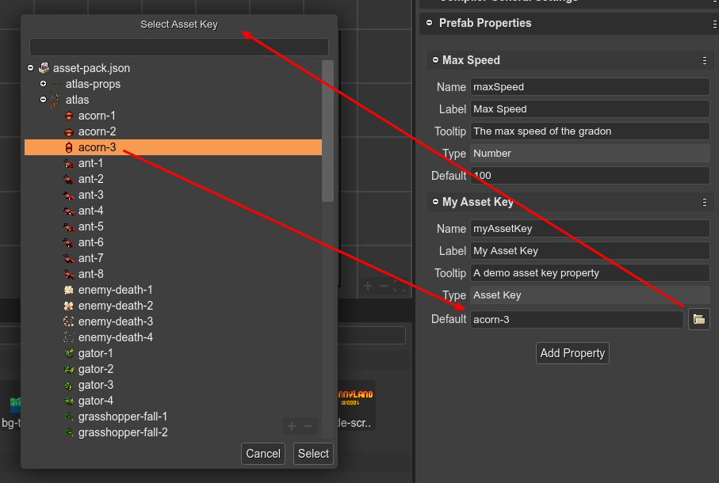

.. include:: ../_header.rst

Asset Key property type
```````````````````````

The Asset Key property type is just like a simple String property type, but it allows to open a dialog with all the |AssetPackFile|_ keys defined in the project. Then, when you select a key in the dialog, it will be set as value to the property.



|br|

The |SceneCompiler|_ generates Asset Key properties like this:

.. code::

    class Dragon extends Phaser.GameObjects.Sprite {
        
        constructor(..) {
            ...
        }

        /** @type {string} */
        myAssetKey = "acorn-3";
    }
