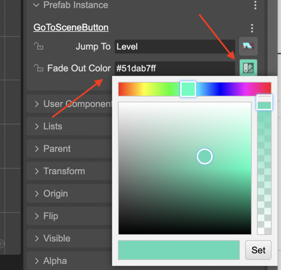

.. include:: ../_header.rst

Color property type
```````````````````

The color property type accepts string values with the format of colors. It provides a dialog for picking a color and returns it with a hex format (including the alpha component).



|br|

The |SceneCompiler|_ generates the code for defining a Color property like this:

.. code::

    class GoToSceneButton extends Phaser.GameObjects.Image {
    
        ...
        
        /** @type {string} */
        fadeOutColor = "#ffffffff";
    }

And generates the code for setting the property in a scene:

.. code::
    
    // goToSceneButton (prefab fields)
    goToSceneButton.fadeOutColor = "#ff00b5ff";

There are many different ways of representing a color, you can use the `Phaser.Display.Color <https://newdocs.phaser.io/docs/3.55.2/Phaser.Display.Color>`_ class for converting to different formats.
