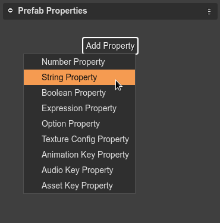
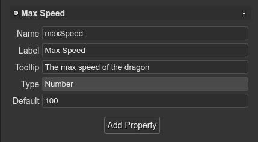
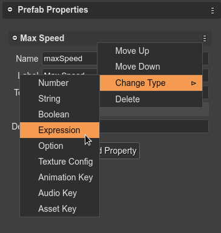

.. include:: ../_header.rst

Creating a prefab user property
```````````````````````````````

The **Prefab Properties** section of the |InspectorView|_ shows a button to create a new user property. This section is shown when you select the scene (click on a blank space of the scene).

Click on the **Add Property** button to create a new property. The button shows a menu with the different type of properties:



All type of properties requires some common parameters that you should provide:

* The **Name** of the property. It is used by the compiler to generate a property declaration code. It should be a valid JavaScript identifier.
* The **Label**. It is a UI friendly version of the **Name**. For example, the label for the **maxSpeed** name could be **Maximum Speed**. In code, is generated a **maxSpeed** field, but the UI shows **Maximum Speed**.
* The **Tooltip**. Used in the UI as documentation of the property.
* The **Default** value. 



In the title bar of the property, there is a menu with commands to: 

    * Move the property down/up.
    * Change the type of the property.
    * Delete the property.
    
You can undo/redo all these changes.

