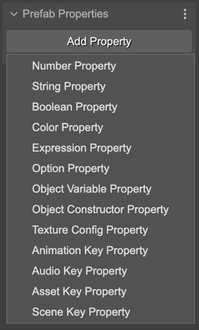
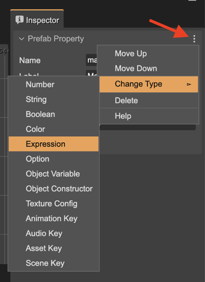

.. include:: ../_header.rst

Creating a prefab user property
```````````````````````````````

The **Prefab Properties** section of the |InspectorView|_ shows a button to create a new user property. This section is shown when you select the scene (click on a blank space of the scene), or when you select the **Prefab Properties** element in the |OutlineView|_:

.. image:: ../images/prefab-user-props-node-outline-view-20221102.webp
  :alt: The Prefabs Properties in the Outline view.

Click on the **Add Property** button to create a new property. The button shows a menu with the different type of properties:



The properties are shown as children of the **Prefab Properties** element. Click a property for editing it in the |InspectorView|_:

.. image:: ../images/prefab-user-props-as-children-outline-20221102.webp
  :alt: Display all properties of a prefab.

All type of properties requires some common parameters that you should provide:

* The **Name** of the property. It is used by the compiler to generate a property declaration code. It should be a valid JavaScript identifier.
* The **Label**. It is a UI friendly version of the **Name**. For example, the label for the **maxSpeed** name could be **Maximum Speed**. In code, is generated a **maxSpeed** field, but the UI shows **Maximum Speed**.
* The **Tooltip**. Used in the UI as documentation of the property.
* The **Default** value. 
* The **Custom Definition** flag. If enabled, the |SceneCompiler|_ skips the generation of the code with the property declaration. It allows you writing a custom implementation of the property. For example, using a custom getter and setter. Learn more about `using properties with custom definition <prefab-user-properties-initializing.html#using-properties-with-custom-definition>`_.


The menu of the property section shows the following actions:

    * Move the property down/up.
    * Change the type of the property.
    * Delete the property.
    
You can undo/redo all these changes.

