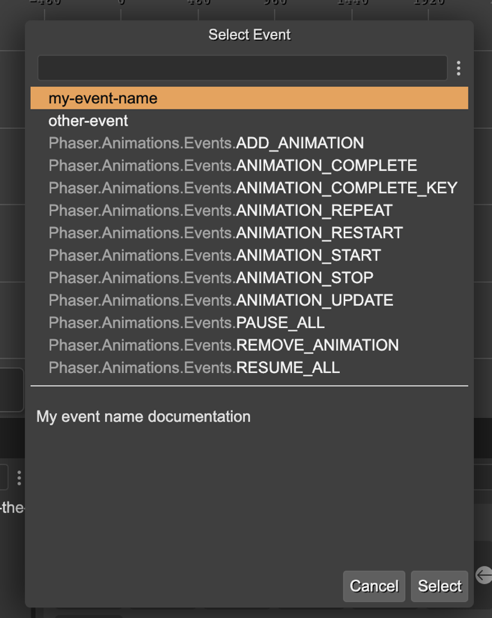

.. include:: ../_header.rst

Event property type
```````````````````

This type of property allows selecting an event name from a list of the Phaser_ events plus custom-defined events. It also allows writing any arbitrary event name.

To open the list of available events, click on the search button. It opens a dialog with the Phaser_ and custom events:


When you click on an event name, the bottom pane of the dialog shows the documentation.

Dynamic keyboard events
'''''''''''''''''''''''

Phaser_ provides the special ``Phaser.Input.Keyboard.Events.KEY_DOWN`` and ``Phaser.Input.Keyboard.Events.KEY_UP`` events. These events allow listening to the keys defined in the ``KeyCodes`` class, combining in this way:

.. code::

	this.input.keyboard.on('keydown-SPACE', listener);

Where ``SPACE`` is a constant in the ``KeyCodes`` class, and ``keydown`` (or ``keyup``) is the name of the event.

The Event property dialog shows all combinations of ``keydown-`` and ``keyup-`` with the ``KeyCodes`` values.


Dynamic animation events
''''''''''''''''''''''''

From the Phaser_ documentation:

	The Animation Complete Dynamic Key Event.

	This event is dispatched by a Sprite when an animation playing on it completes playback.
	This happens when the animation gets to the end of its sequence, factoring in any delays
	or repeats it may have to process.

	The difference between this and the **ANIMATION_COMPLETE** event is that this one has a dynamic event name that contains the name of the animation within it.
	For example, if you had an animation called explode you could listen for the completion of that specific animation by using:

	``sprite.on('animationcomplete-explode', listener)``

The Event property dialog collects all the animations available in the `animation files <../animations-editor/>`_ of your project and generates the ``animationcomplete-key`` events:


Dynamic Spine events
''''''''''''''''''''

Spine_ skeletons contain user events that are fired at a certain moment of an animation. The Event property dialog shows all the events defined in all the Spine_ skeleton assets present in the |AssetPackFiles|_:


`Learn more about the Spine events <https://esotericsoftware.com/spine-events>`_

Custom events
'''''''''''''

In addition to the Phaser_ events, the dialog shows custom events defined in an ``events.txt`` file. Since version 3.62.0 of the editor, this file is included in all project templates. However, you can create this file yourself in any folder of your project. The syntax is very simple. In every line, you define an event, and the name and the documentation are separated with a space. Like this:

.. highlight:: bash

.. code::

	my-event-name My event name documentation
	# the editor ignores all lines starting with #
	other-event My other event.

Then, the Event property dialog will show the custom events at the beginning of the list:



Event code generation
'''''''''''''''''''''

The |SceneCompiler|_ generates the Event properties like this:

.. code::

	class Dragon extends Phaser.GameObjects.Sprite {
 
		constructor(..) {
			... 
		}
 
  		jumpEvent = Phaser.Input.Events.GAMEOBJECT_POINTER_DOWN;
	}

