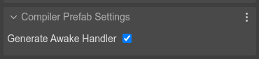

.. include:: ../_header.rst

Initializing other properties
`````````````````````````````

It's possible you want to change other properties of the prefab instance, in dependence of the values of the user properties. For example, if the **flameType** property value is ``"fire"``, then you set the mass of the body to ``50``. Because the property values are not set in the constructor, you can listen to the ``scene-awake`` event and setup the body properties:

.. code::

    class Dragon extends Phaser.GameObjects.Sprite {
        
        constructor(scene,...) {
            ...

            /* START-USER-CTR-CODE */

            scene.events.once("scene-awake", this.awake, this);
            
            /* END-USER-CTR-CODE */
        }

        /** @type {"fire"|"smoke"|"laser"} */
        flameType = "fire";

        /* START-USER-CODE */

        awake() {
            
            // at this point, all objects in the scene are created
            // and the user properties are set with new values

            if (this.flameType === "fire") {
                this.body.mass = 50;
            }
        }

        /* END-USER-CODE */
    }

If you enable the **Generate Awake Handler** flag in the **Compiler Prefab Settings**, the |SceneCompiler|_ will generate this code for you:



.. code::

    class Level extends Phaser.GameObjects.Image {

        constructor(scene,...) {
            
            // awake handler
            this.scene.events.once("scene-awake", () => this.awake());

            ...
        }
    }

It is your responsibility to write the ``awake`` method.

The ``scene-awake`` event
'''''''''''''''''''''''''

The ``scene-awake`` event is not part of the Phaser_ API. It's a custom event the |SceneEditor|_ uses as convention. When the |SceneCompiler|_ generates the code of a scene, it also generates the code for emitting the ``scene-awake`` event. This event is emitted just after all objects are created:

.. code::

    class Level extends Phaser.Scene {
    ...
        editorCreate() {            
            ...
            
            // dragon
            const dragon = new Dragon(this, 370, 218);
            this.add.existing(dragon);

            ...

            // dragon (prefab fields)
            dragon.maxSpeed = 300;
            dragon.flameType = "smoke";
            dragon.onClickHandler = obj => this.selectDragon(obj);            
            ...

            this.events.emit("scene-awake");
        }
    ...
    }

As we mentioned in the previous sections, prefabs_ and `user components <./user-components.html>`_ can listen to this event for reading the values set to the user properties.

It is important that you keep in mind that if you create a dynamic prefab instance, and it requires the ``scene-awake`` event, then you should call it manually:

.. code::

    spawnDino(scene, x, y, flame) {

        const dragon = new Dragon(scene, x, y);
        dragon.flameType = flame;
        // send the awake notification to the new object
        scene.events.emit("scene-awake");
    }

Because the ``scene-awake`` event is listened once in prefabs_ and `user components`_, only the new objects will be notified.

As alternative to the ``scene-awake`` event, you can listen the ``Phaser.Scenes.Events.UPDATE`` event. It is emitted by the scene at every tick, so you just need to register the listener to be called **once**:

.. code::

    scene.events.once("Phaser.Scenes.Events.UPDATE", this.start, this);

Note that if you need to "awake" prefab before the game starts updating, you should listen to the ``scene-awake`` event.

The ``scene-awake`` event is also used by components, `learn more about it <./user-components-awake-event.html>`_.

Using properties with custom definition
'''''''''''''''''''''''''''''''''''''''

You can set a user property with a **Custom Definition**:

.. image:: ../images/prefab-user-properties-initializing-custom-prop-07092021.webp
    :alt: Set custom definition flag.

This means, the |SceneCompiler|_ skips the definition of the property. For example, if you set the ``flameType`` as **Custom Definition**, the ``flameType`` property declaration isn't generated. Instead, a ``flameType`` property initialization is included in the constructor: 

.. code::

    class Dragon extends Phaser.GameObjects.Sprite {
        
        constructor(scene,...) {
            ...

            // the compiler adds this
            this.flameType = "fire";
        }

        // the compiler skips this:
        // flameType = "fire";
    }

Then, you can write a custom setter and initialize other fields of the prefab:

.. code::

    class Dragon extends Phaser.GameObjects.Sprite {
        
        constructor(scene,...) {
            ...
            this.flameType = "fire";
        }

        /* START-USER-CODE */

        set flameType(flameType) {
            
            // update the body with the flameType

            if (flameType === "fire") {
                this.body.mass = 50;
            }
        }

        /* END-USER-CODE */
    }

Note that you don't need to listen for the ``prefab-awake`` event anymore. Setting the ``flameType`` property will update the prefab state in the expected way. It's possible you also need to define a getter for the ``flameType``. If that's the case, you can store its value in a new field, or compute it.
