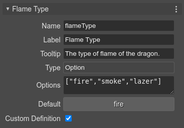

.. include:: ../_header.rst

Initializing other properties
`````````````````````````````

It's possible you want to change other properties of the prefab instance, in dependence of the values of the user properties. For example, if the **flameType** property value is ``"fire"``, then you set the mass of the body to 50. Because the property values are not set in the constructor, you can listen to the ``prefab-awake`` event and setup the body properties:

.. code::

    class Dragon extends Phaser.GameObjects.Sprite {
        
        constructor(scene,...) {
            ...

            /* START-USER-CTR-CODE */
            scene.events.once("prefab-awake", this.awake, this);
            /* END-USER-CTR-CODE */
        }

        /** @type {"fire"|"smoke"|"laser"} */
        flameType = "fire";

        /* START-USER-CODE */

        awake() {
            
            // at this point, the instance was created and the user properties set with new values

            if (this.flameType === "fire") {
                this.body.mass = 50;
            }
        }

        /* END-USER-CODE */
    }

The ``prefab-awake`` event is not part of the Phaser_ API. It's a custom event the |SceneEditor|_ uses as convention. When the |SceneCompiler|_ generates the code of a prefab instantiation, it also generates the code for emitting the ``prefab-awake`` event. This event is emitted just after all properties are set.

.. code::

    class Level extends Phaser.Scene {
    ...
        create() {            
            ...
            
            // dragon
            const dragon = new Dragon(this, 370, 218);
            this.add.existing(dragon);

            ...

            // dragon (prefab fields)
            dragon.maxSpeed = 300;
            dragon.flameType = "smoke";
            dragon.onClickHandler = obj => this.selectDragon(obj);
            dragon.emit("prefab-awake");
            ...
        }
    ...
    }

As alternative to the ``prefab-awake`` event, you can listen the ``Phaser.Scenes.Events.UPDATE`` event. It is emitted by the scene at every tick, so you just need to register the listener to be called **once**:

.. code::

    scene.events.once("Phaser.Scenes.Events.UPDATE", this.start, this);

A key difference of the  **UPDATE** event is that it is fired after all objects are created. You can use it when your prefab depends on other objects of the scene.


Using properties with custom definition
'''''''''''''''''''''''''''''''''''''''

You can set a user property with a **Custom Definition**:



This means, the |SceneCompiler|_ skips the definition of the property. For example, if you set the ``flameType`` as **Custom Definition**, the ``flameType`` property declaration isn't generated. Instead, a ``flameType`` property initialization is included in the constructor: 

.. code::

    class Dragon extends Phaser.GameObjects.Sprite {
        
        constructor(scene,...) {
            ...

            // the compiler adds this
            this.flameType = "fire";
        }

        // the compiler skips this:
        // flameType = "fire";
    }

Then, you can write a custom setter and initialize other fields of the prefab:

.. code::

    class Dragon extends Phaser.GameObjects.Sprite {
        
        constructor(scene,...) {
            ...
            this.flameType = "fire";
        }

        /* START-USER-CODE */

        set flameType(flameType) {
            
            // update the body with the flameType

            if (flameType === "fire") {
                this.body.mass = 50;
            }
        }

        /* END-USER-CODE */
    }

Look you don't need to listen the ``prefab-awake`` event anymore. Setting the ``flameType`` property will update the prefab state in the expected way. It's possible you also need to define a getter for the ``flameType``. If that's the case, you can store its value in a new field, or compute it.