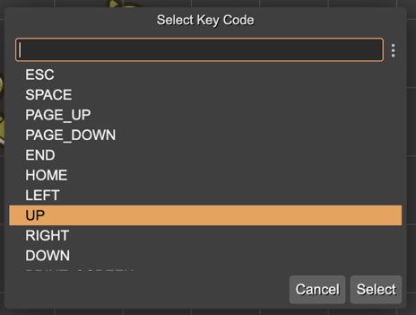

.. include:: ../_header.rst

Key Code property type
```````````````````````

This type of property allows selecting one of the key codes available in the ``Phaser.Input.Keyboard.KeyCodes`` class:


  


You can use properties of this type for binding the behavior of an object or a game action with a certain keyboard key.

Property code generation
''''''''''''''''''''''''

The |SceneCompiler|_ generates the Key Code properties like this:

.. code::

	class Dragon extends Phaser.GameObjects.Sprite {
 
		constructor(..) {
			... 
		}
 
  		private jumpKey: number = Phaser.Input.Keyboard.KeyCodes.UP;
	}

