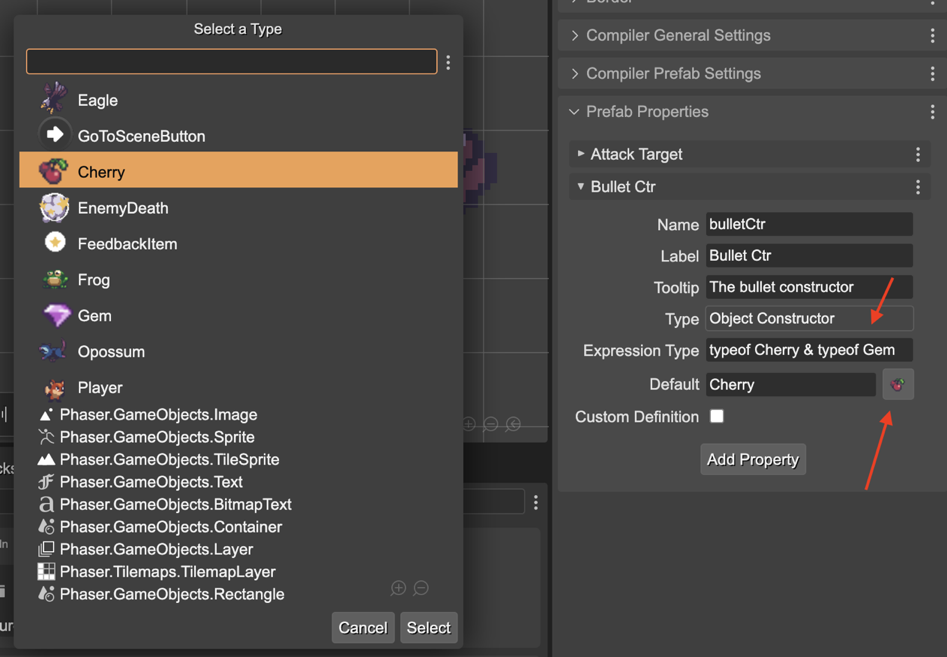

.. include:: ../_header.rst

Object Constructor property type
````````````````````````````````

With this property type you can create a user property for holding an object constructor (saying it in another way: a class). It's like the `Expression property type <./prefab-user-properties-expression-type.html>`_, but with a dialog for selecting a prefab class or built-in game object class.

Look in the next image, how you can select a prefab or a built-in Phaser_ type as expression:




It will generate a property definition like this:

.. code::

	bulletCtr!: typeof Cherry & typeof Gem = Cherry;

This means, that you can use that property for creating a new object, a **Cherry** or **Gem** object:

.. code::

    createBullet(x: number, y: number) {

        const bullet = new this.bulletCtr(this.scene, x, y);

        return bullet;
    }