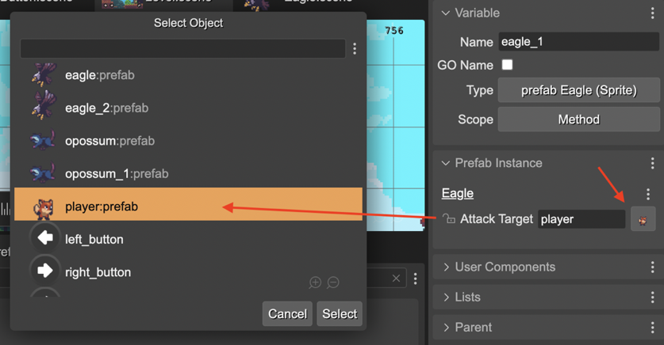

.. include:: ../_header.rst

Object Variable property type
`````````````````````````````

This user property type is dedicated for referencing objects in the scene. It provides a dialog for selecting an object in the scene and sets as value of the property, the name of the variable referencig the object:




This property type if a subset of the `Expression property type <./prefab-user-properties-expression-type.html>`_. You can define the type of the property. By default, it is ``Phaser.GameObjects.Game``, but you can write any other type.

.. code::
    
    class Eagle extends Phaser.GameObjects.Sprite {
    
        ...

        /** @type {Phaser.GameObjects.GameObject} */
	    attackTarget;
    }

The value set to this property is is verbatim-copied to the generated code:

.. code::

    // eagle (prefab fields)
    eagle.attackTarget = player;