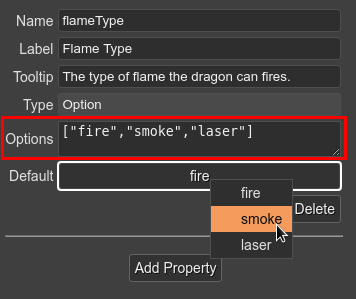

.. include:: ../_header.rst

Option property type
````````````````````

The Option type allows the user to select one of the predefined string values. It is like traditional enum types. In addition to the common parameters, the Option properties have the **Options** parameter. You should write all the possible values with a valid JSON array syntax:



Note the **Default** value should be one of the possible values. 

The compiled property is like this:

.. code::

    class Dragon extends Phaser.GameObjects.Sprite {
        
        constructor(...) {
            super(...);                
            ...
            /** @type {"fire"|"smoke"|"laser"} */
            this.flameType = "fire";
        }
    }        
