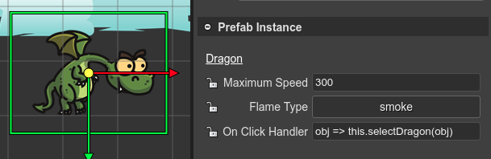

.. include:: ../_header.rst

User properties in a prefab instance
````````````````````````````````````
This is how the properties you defined in a prefab_ are presented in the **Prefab Instance** section of a prefab_ instance:



The user properties are shown just like any other property of a prefab_ instance.

The code, generated by the |SceneCompiler|_, that creates the prefab_ instance and initialize the properties will look like following. Note the **dragon** instance is created first, and the user properties are initialized later, at the end of the method. By setting the user properties at the end, it allows you to set references to another objects created in the scene:

.. code::

    class Level extends Phaser.Scene {
    ...
        create() {            
            ...
            
            // dragon
            const dragon = new Dragon(this, 370, 218);
            this.add.existing(dragon);

            ...

            // dragon (prefab fields)
            dragon.maxSpeed = 300;
            dragon.flameType = "smoke";
            dragon.onClickHandler = obj => this.selectDragon(obj);
            dragon.emit("prefab-awake");
            ...
        }
    ...
    }

In the next sections are covered the topics to create prefab_ instances and to change the properties.