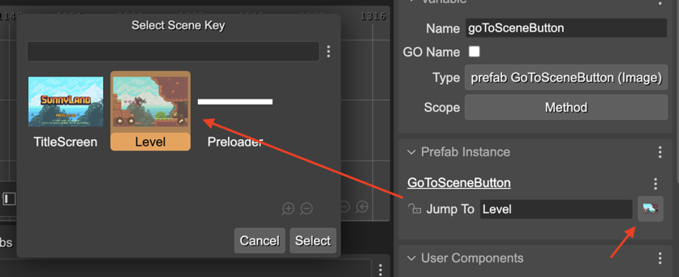

.. include:: ../_header.rst

Scene Key property type
```````````````````````

This user property type allows any string values, but provides a dialog for selecting a scene key. This dialog shows all the scenes of the project and you can pick one. Then, its key is set as value.



|br|

The |SceneCompiler|_ generates Scene Key properties like this:

.. code::

    class GoToSceneButton extends Phaser.GameObjects.Sprite {
        
        constructor(..) {
            ...
        }

        /** @type {string} */
        jumpTo;
    }

And the code it generates in the scene is like this:

.. code::

    // goToSceneButton (prefab fields)
    goToSceneButton.jumpTo = "Level";