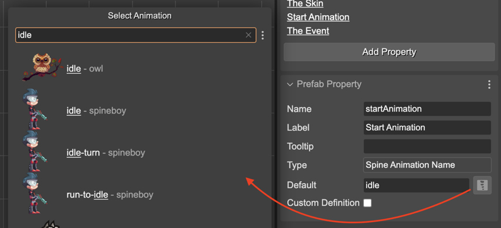

.. include:: ../_header.rst

Spine Animation Name property type
``````````````````````````````````
This user property type allows any string values but provides a dialog for selecting an animation name. This dialog lists the names of all animations defined in all the Spine_ skeleton assets in the |AssetPackFiles|_ of the project. You can pick one name, then it is set as a value of the property.



The |SceneCompiler|_ generates Spine Animation Name properties like this:

.. code::

    class Player extends SpineGameObject {
        
        constructor(..) {
            ...
        }

        startAnimation: string;
    }

And the code it generates in the scene is like this:

.. code::

    player.startAnimation = "idle";