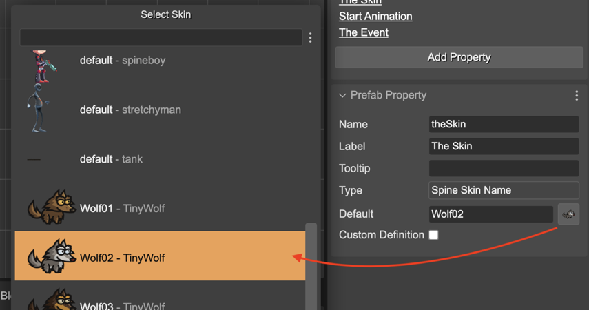

.. include:: ../_header.rst

Spine Skin Name property type
`````````````````````````````
This user property type allows any string values but provides a dialog for selecting a Spine skeleton skin. This dialog lists the names of all skins defined in all the Spine_ skeleton assets in the |AssetPackFiles|_ of the project. You can pick one name, then it is set as a value of the property.



The |SceneCompiler|_ generates Spine Skin Name properties like this:

.. code::

    class Player extends SpineGameObject {
        
        constructor(..) {
            ...
        }

        theSkin: string;
    }

And the code it generates in the scene is like this:

.. code::

    player.theSkin = "Wolf02";