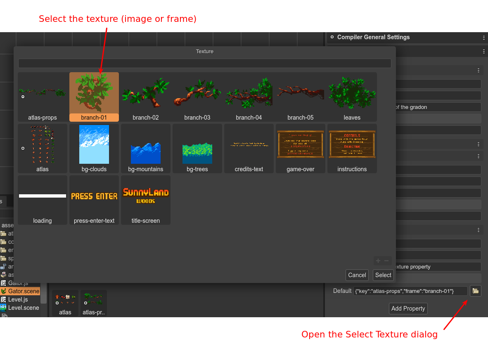

.. include:: ../_header.rst

Texture Config property type
````````````````````````````

This type of property allows to select a texture between all the textures defined in the an |AssetPackFile|. When the texture is selected, the property gets as value the configuration of the texture. For example, if the selected texture is an image with key **background**, the property is set to:

.. code:: 
    
    { "key": "background" } 

If the selected texture is the frame **branch-01** of the atlas **atlas-props**, then the property is set to: 

.. code::

    { "key": "atlas-props", "frame": "branch-01" }



The |SceneCompiler|_ generates Texture Config properties like this:

.. code::

    class Dragon extends Phaser.GameObjects.Sprite {
        
        constructor(..) {
            ...
            /** @type {{key:string,frame?:string|number}} */
            this.myTexture = {"key":"atlas-props","frame":"branch-01"};
        }
    }
